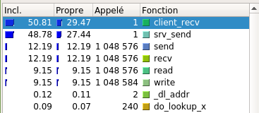
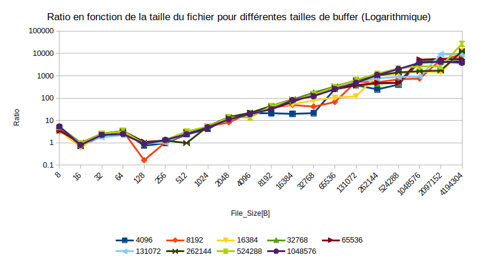
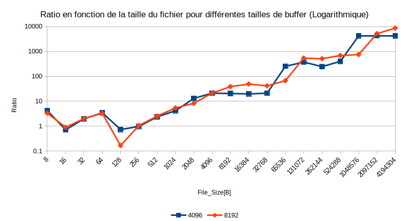
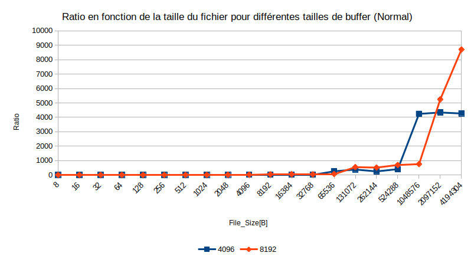
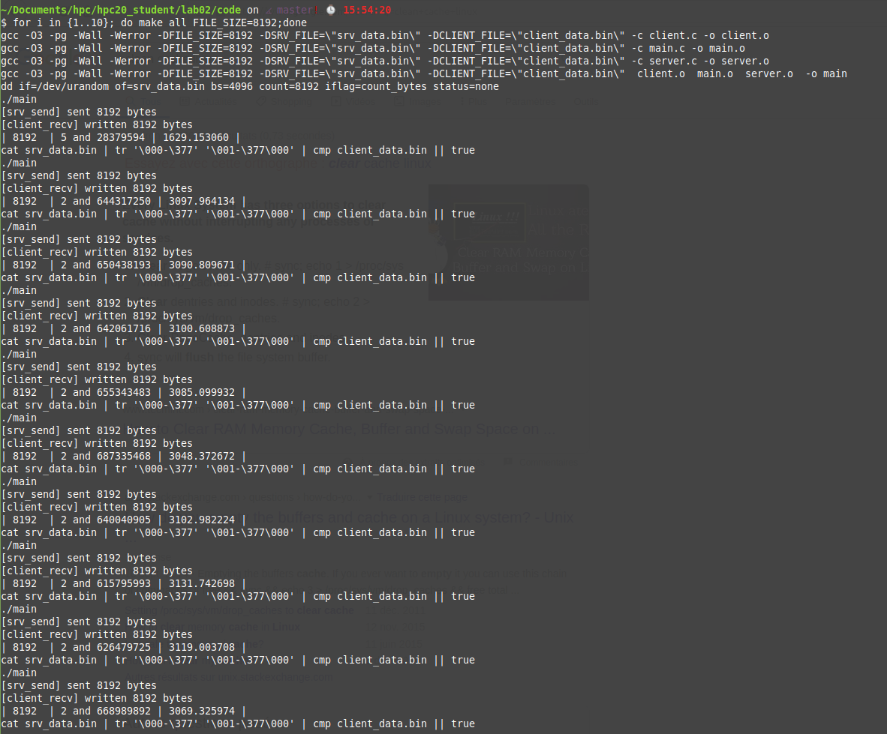

# HPC Laboratoire 2 : Transfert d’un fichier
##### Auteur : Pierrick Muller

## Donnée
### Objectif :
Améliorer les performances d’un programme simple.
### Introduction
Le programme fourni se fork en deux processus : un processus serveur et un processus client. Le serveur lit un fichier de taille plus ou moins volumineuse depuis le disque, incrémente chaque byte lu de 1, le transfert au client qui à son tour l’écrit sur le disque sous un nom différent. Le temps total de l’opération est mesuré puis le débit calculé.Votre but est d’améliorer le code afin d’accélérer l’opération. La seule contrainte étant que le fichier doit être lu depuis le disque par le serveur, **chaque byte doit être incrémenté de 1**, puis le résultat est écrit sur le disque par le client.
### Makefile
Le *Makefile* possède plusieurs cibles :
- *run* compile, crée le fichier et lance l’exécution du programme.
- *verify* utilise cmp et tr pour comparer les deux fichiers et s’assure que chaque byte diffère de 1
- *clean* efface également le fichier généré.
- *all* effectue toutes les cibles dans l’ordre.

Le Makefile possède également un paramètre $FILE_SIZE qui fera varier la taille du fichier généré. Vousmodifierez cette taille en fonction des performances de votre programme.

*Exemple : make run FILE_SIZE=8192 produit un fichier de taille 8k et lance le programme.*

Entre la première execution du programme et les suivantes sur le même fichier, que remarquez-vous et comment l’expliquez-vous ? Est-ce que la taille du fichier a une importance ? Donnez votre analyse dans le rapport.

## Situation initiale
Pour commencer, j'ai exécuté le programme de base sans modification et sans outils supplémentaires, afin de voir les résultats en terme de temps fournis par le programme. J'ai choisi de modifier la taille par un facteur 2 lors de chaque lancement du programme, en commençant avec une taille de 8 bytes et en allant jusqu'à ce que le temps d'attente excède 1 heure. Pour cela j'ai créé un petit script en pensant qu'il me serait utile plus tard :
```bash
#!/bin/bash
set -e
START_BYTES=8
TEMP=2**30
END_BYTES=$START_BYTES*$TEMP
echo "start bash script "
for ((c=$START_BYTES;c<=$END_BYTES;c*=2))
do
  make clean
  make all FILE_SIZE="$c"
done
echo "end bash script "
```
J'ai pu obtenir les valeurs suivantes :

##### 1er lancement

| Size          | Time(sec and ns)   | Rate(bytes/sec)  |
| ------------- |:-------------:     | -----:           |
| 8 bytes       | 0 and 6552809      | 1220.850478      |
| 16 bytes      | 0 and 11384258     | 1405.449525      |
| 32 bytes      | 0 and 30948549     | 1033.974161      |
| 64 bytes      | 0 and 40668816     | 1573.687319      |
| 128 bytes     | 0 and 118226675    | 1082.665989      |
| 256 bytes     | 0 and 161507611    | 1585.064620      |
| 512 bytes     | 0 and 378394948    | 1353.083604      |
| 1024 bytes    | 0 and 638163870    | 1604.603532      |
| 2048 bytes    | 1 and 551524552    | 1319.992002      |
| 4096 bytes    | 2 and 599507030    | 1575.683371      |
| 8192 bytes    | 5 and 104584863    | 1604.831778      |
| 16384 bytes   | 10 and 291956324   | 1591.922807      |
| 32768 bytes   | 20 and 655504277   | 1586.405229      |
| 65536 byte    | 42 and 830743142   | 1530.115875      |
| 131072 bytes  | 85 and 605795927   | 1531.111283      |
| 262144 bytes  | 172 and 634450025  | 1518.491819      |
| 524288 bytes  | 341 and 799725340  | 1533.904100      |
| 1048576 bytes | 694 and 92358588   | 1510.715378      |
| 2097152 bytes | 1397 and 822311138 | 1500.299418      |
| 4194304 bytes | 2810 and 677514693 | 1492.275075      |


J'ai arrêté le programme après l'obtention du dernier résultat (4194304 bytes), car il a pris ~ 40 minutes avant de terminer, et que j'avais prévu de prendre de m'arrêter lorsqu'un résultat prendrais plus d'une heure, ce qui aurait été le cas du palier suivant.

J'ai aussi utilisé kcachegrind afin de récupérer plus d'informations sur les fonctions problématiques du programme :


Deux colonnes sont intéressantes dans notre cas, la colonne "Propre" qui représente le coût propre de la fonction et la colonne appelé, qui représente le nombre de fois que la fonction est appelée dans le programme. On peut donc voir que la partie qui nous intéressera pour le moment sera la partie concernant les fonctions send, recv, read et write, qui sont appelé pour chaque byte de la transmission entre client et serveur. En effet, lorsqu'on utilise l'une de ces 4 fonctions, on effectue un appel système à chaque fois. Les appels systèmes étant couteux en terme de temps, le problème du programme vient de la.

À l'aide de ces informations, j'ai pu effectuer une modification sur le code qui nous était fourni afin d'améliorer ses performances.

## Bufferisation  

Dans l'optique de réduire le nombre d'appels systèmes, j'ai décidé de regrouper la récupération, l'envoi, la réception et l'écriture des bytes. Le résultat peut être observé dans les fichiers client et server de ma solution, et il n'y a pas grand-chose à dire dessus. j'ai juste dû m'assurer que le nombre de bytes récupérer n'était pas plus petit que la taille du buffer, afin d'éviter des problèmes de récupération de bytes lors de l'exécution du projet. Pour incrémenter les bytes de 1, j'ai simplement ajouté une boucle qui parcourt les bytes reçus et qui incrémente tous les bytes de 1.

J'ai ensuite récupéré les nouvelles valeurs pour différentes tailles de buffer, en commençant par 4096 bytes. Les tableaux montrant les différentes valeurs obtenues sont disponibles dans les annexes de ce document, et ci-dessous se trouve un graphique représentant les résultats obtenus en terme de ratio:




L'échelle est logarithmique afin de mieux voir la progression du ratio en fonction de la taille du buffer. Ce graphique nous montre une nette amélioration des temps d'exécution via le ratio qui augmente avec la taille du fichier. Cependant, lors de la récupération des données, j'ai pu observer des problèmes pour des tailles de buffer supérieurs à 16384 bytes. En effet, deux types d'erreurs apparaissaient lors de l'utilisation de buffers supérieurs à 16384 bytes , soit :
- cmp: Fin-de-fichier (EOF) sur client_data.bin après l'octet X, ligne Y
- client_data.bin - sont différents: octet X, ligne Y

À ces erreurs s'ajoutaient des erreurs de segmentation lors de l'utilisation d'un buffer très grand (1Go pour l'exemple.). Cette erreur vient du fait que la taille de la stack n'est pas suffisante pour contenir l'intégralité du buffer qui est allouée. Ainsi, une solution consisterait à allouer dynamiquement le buffer afin de profiter de la heap qui est plus grande. Cependant, cela ne règle pas les deux autres problèmes vus plus tôt, qui sont des problèmes qui surviennent lors de la copie. Afin de tenter de les résoudre, j'ai observé les flags fournit pour send et recv, mais je n'ai pas réussi à trouver de solution permettant de régler le problème. J'ai donc décidé de me bloquer à une taille de buffer maximale de 8192 bytes, car je me suis rendu compte qu'au delà de ça, pour un buffer de 16384 bytes, l'erreur lors de la comparaison apparaissait pour un fichier de 1Go. J'ai donc recréé le schéma en supprimant les tailles de buffer qui étaient problématiques :




De plus, en observant les tableaux fournit en annexe, on peut voir un net avantage à utiliser un buffer de 8192 bytes afin de diminuer le temps d'exécution du programme sans subir de problèmes supplémentaires. En effet, pour un transfert d'1 Go, un buffer de 8192 bytes permet de diminuer le temps d'exécution de moitié par rapport à un buffer de 4096.

Ainsi, a l'aide de buffer et en s'assurant qu'aucun problème n'entache le déroulement du programme, un buffer 8192 bytes et le meilleur compromis pour ce programme sur mon système. Si pour les premières tailles de fichiers le ratio d'amélioration n'est pas énorme (entre 4 et 15 pour les tailles allant de 8 bytes à 2048 bytes), l'amélioration devient plus intéressantes par la suite, avec un ratio d'amélioration d'environ 8700 pour une taille de fichier de 512k avec un buffer 8192 bytes.

J'ai donc implémenté dans la version finale la solution utilisant un buffer de 8192 bytes.

## Analyse portant sur les questions posées dans la partie Makefile
*Entre la première execution du programme et les suivantes sur le même fichier, que remarquez-vous et comment l'éxpliquez-vous ?*

Afin de tester ce phénomène, j'ai lancé le programme de base 10 fois avec une taille de 8192 bytes :


On peut voir que les exécutions ayant lieu après le premier lancement prennent moins de temps que ce dernier. Cela s'explique par la présence en cache des données utilisées pour le premier lancement, ce qui permet au cpu de prendre moins de temps afin de récupérer les données nécessaires.

J'ai pu tester la version bufférisée aussi, et le même résultat en est ressorti.

*Est-ce que la taille du fichier a une importance ?*
Non, la taille du fichier n'a pas d'importance dans ce cas-là, que ce soit avec la version bufférisée ou pas.

## Annexes

### Résultats buffer 4096
| Size          | Time(sec and ns)   | Rate(bytes/sec)  |
| ------------- |:-------------:     | -----:           |
| 8  | 0 and 1553671 | 5149.095272 |
| 16  | 0 and 1594729 | 10033.052638 |
| 32  | 0 and 1567500 | 20414.673046 |
| 64  | 0 and 1178456 | 54308.349230 |
| 128  | 0 and 1610016 | 79502.315505 |
| 256  | 0 and 1659908 | 154225.414903 |
| 512  | 0 and 1601624 | 319675.529338 |
| 1024  | 0 and 1528033 | 670142.595088 |
| 2048  | 0 and 1185503 | 1727536.750223 |
| 4096  | 0 and 1225018 | 3343624.338581 |
| 8192  | 0 and 2482697 | 3299637.450724 |
| 16384  | 0 and 5187990 | 3158063.141988 |
| 32768  | 0 and 9750351 | 3360699.527638 |
| 65536  | 0 and 16833886 | 3893099.905750 |
| 131072  | 0 and 22716517 | 5769898.616060 |
| 262144  | 0 and 69746292 | 3758536.726225 |
| 524288  | 0 and 84879039 | 6176884.259964 |
| 1048576  | 0 and 163862961 | 6399103.211616 |
| 2097152  | 0 and 322358550 | 6505650.307709 |
| 4194304  | 0 and 658816234 | 6366424.783637 |
| 8388608  | 1 and 313126256 | 6388272.233283 |
| 16777216  | 2 and 715144856 | 6179123.726281 |
| 33554432  | 6 and 365089067 | 5271635.894926 |
| 67108864  | 11 and 704500297 | 5733594.967502 |
| 134217728  | 21 and 281953373 | 6306645.148950 |
| 268435456  | 44 and 205211260 | 6072484.405089 |
| 536870912  | 102 and 49460404 | 5260889.277362 |
| 1073741824  | 263 and 650541438 | 4072594.799706 |

### Résultats buffer 8192
| Size          | Time(sec and ns)   | Rate(bytes/sec)  |
| ------------- |:-------------:     | -----:           |
| 8  | 0 and 1977735 | 4045.031311 |
| 16  | 0 and 1259956 | 12698.856151 |
| 32  | 0 and 1545905 | 20699.848956 |
| 64  | 0 and 1224550 | 52264.097015 |
| 128  | 0 and 7127366 | 17958.948649 |
| 256  | 0 and 1529981 | 167322.339297 |
| 512  | 0 and 1486119 | 344521.535624 |
| 1024  | 0 and 1179846 | 867909.879764 |
| 2048  | 0 and 1879592 | 1089598.168113 |
| 4096  | 0 and 1209703 | 3385955.065004 |
| 8192  | 0 and 1318095 | 6215030.024391 |
| 16384  | 0 and 2085923 | 7854556.472123 |
| 32768  | 0 and 4950385 | 6619283.146664 |
| 65536  | 0 and 6381055 | 10270401.994654 |
| 131072  | 0 and 15758159 | 8317722.901514 |
| 262144  | 0 and 33672227 | 7785169.659257 |
| 524288  | 0 and 49364836 | 10620677.439301 |
| 1048576  | 0 and 92400460 | 11348168.613013 |
| 2097152  | 0 and 266426869 | 7871398.286034 |
| 4194304  | 0 and 322783272 | 12994180.194072 |
| 8388608  | 0 and 655423631 | 12798757.327686 |
| 16777216  | 1 and 540592468 | 10890106.467793 |
| 33554432  | 2 and 831491077 | 11850445.962045 |
| 67108864  | 5 and 669825257 | 11836143.259820 |
| 134217728  | 11 and 965708572 | 11216864.190899 |
| 268435456  | 25 and 929755895 | 10352409.682799 |
| 536870912  | 55 and 72153223 | 9748500.477657 |
| 1073741824  | 112 and 750903872 | 9523132.738864 |

### Résultats buffer 16384
| Size          | Time(sec and ns)   | Rate(bytes/sec)  |
| ------------- |:-------------:     | -----:           |
| 8  | 0 and 1778291 | 4498.701281 |
| 16  | 0 and 1898665 | 8426.973689 |
| 32  | 0 and 1217914 | 26274.433170 |
| 64  | 0 and 1261113 | 50748.822667 |
| 128  | 0 and 1298366 | 98585.452792 |
| 256  | 0 and 1278548 | 200227.132654 |
| 512  | 0 and 1508867 | 339327.455634 |
| 1024  | 0 and 1236803 | 827941.070647 |
| 2048  | 0 and 1390307 | 1473055.950952 |
| 4096  | 0 and 1265611 | 3236381.478985 |
| 8192  | 0 and 1217089 | 6730814.262556 |
| 16384  | 0 and 1925366 | 8509550.911359 |
| 32768  | 0 and 2618153 | 12515693.315097 |
| 65536  | 0 and 4042993 | 16209773.304084 |
| 131072  | 0 and 7042773 | 18610851.151954 |
| 262144  | 0 and 15979498 | 16405020.983763 |
| 524288  | 0 and 27360344 | 19162332.169508 |
| 1048576  | 0 and 44308829 | 23665170.659328 |
| 2097152  | 0 and 94605022 | 22167448.996524 |
| 4194304  | 0 and 223952416 | 18728549.907673 |
| 8388608  | 0 and 338308981 | 24795699.999463 |
| 16777216  | 0 and 682538431 | 24580617.351347 |
| 33554432  | 1 and 331489283 | 25200677.488292 |
| 67108864  | 3 and 480916704 | 19279077.813865 |
| 134217728  | 5 and 873643062 | 22850848.542080 |
| 268435456  | 11 and 6255887 | 24389352.633266 |
| 536870912  | 23 and 301688413 | 23040000.470544 |
| 1073741824  | 52 and 646064354 | 20395481.356023 |


### Résultats buffer 32768
| Size          | Time(sec and ns)   | Rate(bytes/sec)  |
| ------------- |:-------------:     | -----:           |
| 8  | 0 and 1409469 | 5675.896384 |
| 16  | 0 and 1182639 | 13529.065082 |
| 32  | 0 and 1196913 | 26735.443595 |
| 64  | 0 and 1210219 | 52882.990599 |
| 128  | 0 and 1308768 | 97801.902247 |
| 256  | 0 and 1218383 | 210114.553470 |
| 512  | 0 and 1240088 | 412873.925076 |
| 1024  | 0 and 1251871 | 817975.654041 |
| 2048  | 0 and 1256071 | 1630481.079493 |
| 4096  | 0 and 1246876 | 3285009.896734 |
| 8192  | 0 and 1388382 | 5900393.407578 |
| 16384  | 0 and 1223386 | 13392338.967423 |
| 32768  | 0 and 1148534 | 28530282.952007 |
| 65536  | 0 and 1325838 | 49429870.014285 |
| 131072  | 0 and 2286138 | 57333371.826198 |
| 262144  | 0 and 3969058 | 66046905.840126 |
| 524288  | 0 and 7081770 | 74033469.033871 |
| 1048576  | 0 and 14150359 | 74102430.899456 |
| 2097152  | 0 and 26162981 | 80157226.731923 |
| 4194304  | 0 and 45153988 | 92888893.889062 |
| 8388608  | 0 and 90423209 | 92770518.683981 |
| 16777216  | 0 and 184822318 | 90774838.133996 |
| 33554432  | 0 and 641157255 | 52334168.783601 |
| 67108864  | 0 and 987312552 | 67971245.644611 |
| 134217728  | 2 and 482083594 | 54074620.340930 |
| 268435456 (erreur lors de la comparaison)  | 4 and 882511793 | 54978967.257151 |
| 536870912  | 7 and 521077152 | 71382183.848125 |
| 1073741824 (erreur lors de la comparaison)  | 22 and 81907351 | 48625411.153687 |

### Résultats buffer 65536
| Size          | Time(sec and ns)   | Rate(bytes/sec)  |
| ------------- |:-------------:     | -----:           |
| 8  | 0 and 1862560 | 4295.163646 |
| 16  | 0 and 1183373 | 13520.673532 |
| 32  | 0 and 1224917 | 26124.219029 |
| 64  | 0 and 1219987 | 52459.575389 |
| 128  | 0 and 1074652 | 119108.325300 |
| 256  | 0 and 1271221 | 201381.191783 |
| 512  | 0 and 1238296 | 413471.415558 |
| 1024  | 0 and 1411887 | 725270.506776 |
| 2048  | 0 and 1249077 | 1639610.688532 |
| 4096  | 0 and 1190630 | 3440195.526738 |
| 8192  | 0 and 1588877 | 5155842.774488 |
| 16384  | 0 and 1513154 | 10827714.826118 |
| 32768  | 0 and 1390583 | 23564217.310294 |
| 65536  | 0 and 1733740 | 37800362.222709 |
| 131072  | 0 and 2270112 | 57738120.409918 |
| 262144  | 0 and 3570439 | 73420663.397414 |
| 524288  | 0 and 7085140 | 73998255.503773 |
| 1048576  | 0 and 13234616 | 79229801.605124 |
| 2097152  | 0 and 24391157 | 85980013.166247 |
| 4194304  | 0 and 52520745 | 79859948.673615 |
| 8388608  | 0 and 93434088 | 89781022.960271 |
| 16777216  | 0 and 187525713 | 89466216.294296 |
| 33554432  | 0 and 433332522 | 77433449.594628 |
| 67108864  | 0 and 766301835 | 87574974.944436 |
| 134217728  | 1 and 483368565 | 90481712.479865 |
| 268435456  | 3 and 31604658 | 88545666.827512 |
| 536870912  | 6 and 814879408 | 78779224.085721 |
| 1073741824 (erreur lors de la comparaison)  | 14 and 790901963 | 72594749.575516 |

### Résultats buffer 131072
| Size          | Time(sec and ns)   | Rate(bytes/sec)  |
| ------------- |:-------------:     | -----:           |
| 8  | 0 and 1249652 | 6401.782256 |
| 16  | 0 and 1194324 | 13396.699723 |
| 32  | 0 and 1778680 | 17990.869634 |
| 64  | 0 and 1824755 | 35073.201608 |
| 128  | 0 and 1186324 | 107896.325119 |
| 256  | 0 and 1596483 | 160352.474784 |
| 512  | 0 and 1224365 | 418175.952432 |
| 1024  | 0 and 1178847 | 868645.379765 |
| 2048  | 0 and 1240256 | 1651271.995459 |
| 4096  | 0 and 1204090 | 3401739.072661 |
| 8192  | 0 and 1208602 | 6778079.136060 |
| 16384  | 0 and 1294970 | 12652030.548970 |
| 32768  | 0 and 1250484 | 26204253.712962 |
| 65536  | 0 and 1753947 | 37364869.063888 |
| 131072  | 0 and 1615001 | 81159082.873633 |
| 262144  | 0 and 2234799 | 117300929.524311 |
| 524288  | 0 and 3862538 | 135736658.124787 |
| 1048576  | 0 and 7529486 | 139262626.957537 |
| 2097152  | 0 and 15028650 | 139543605.047692 |
| 4194304  | 0 and 31393989 | 133602136.383497 |
| 8388608  | 0 and 62186775 | 134893761.575512 |
| 16777216  | 0 and 172804362 | 97087919.574623 |
| 33554432  | 0 and 349871613 | 95904985.581097 |
| 67108864  | 0 and 460233560 | 145814798.903409 |
| 134217728  | 1 and 18949309 | 131721692.938505 |
| 268435456 (erreur lors de la comparaison)  | 2 and 723253009 | 98571618.249518 |
| 536870912 (erreur lors de la comparaison) | 5 and 717511328 | 93899405.038485 |
| 1073741824 (erreur lors de la comparaison) | 12 and 222141659 | 87852182.862676 |

### Résultats buffer 262144
| Size          | Time(sec and ns)   | Rate(bytes/sec)  |
| ------------- |:-------------:     | -----:           |
| 8  | 0 and 1311772 | 6098.620797 |
| 16  | 0 and 1143016 | 13998.054270 |
| 32  | 0 and 1286221 | 24879.083766 |
| 64  | 0 and 1198810 | 53386.274722 |
| 128  | 0 and 1185059 | 108011.499849 |
| 256  | 0 and 1276413 | 200562.043790 |
| 512  | 0 and 3893555 | 131499.362408 |
| 1024  | 0 and 1171810 | 873861.803535 |
| 2048  | 0 and 1086919 | 1884225.043448 |
| 4096  | 0 and 1180462 | 3469827.914833 |
| 8192  | 0 and 1143901 | 7161458.902475 |
| 16384  | 0 and 1181527 | 13866801.181860 |
| 32768  | 0 and 1337372 | 24501784.095973 |
| 65536  | 0 and 1286760 | 50931020.547732 |
| 131072  | 0 and 1348474 | 97200242.644649 |
| 262144  | 0 and 1670680 | 156908564.177461 |
| 524288  | 0 and 2394534 | 218951996.505374 |
| 1048576  | 0 and 4331167 | 242100108.354169 |
| 2097152  | 0 and 8119573 | 258283532.890215 |
| 4194304  | 0 and 22170131 | 189187154.554928 |
| 8388608  | 0 and 30846575 | 271946172.306002 |
| 16777216  | 0 and 74579348 | 224957933.394644 |
| 33554432  | 0 and 205190268 | 163528379.425870 |
| 67108864  | 0 and 396283540 | 169345575.140466 |
| 134217728  | 0 and 783011302 | 171412248.657427 |
| 268435456  | 1 and 504424666 | 178430640.009195 |
| 536870912 (erreur lors de la comparaison)   | 2 and 203129263 | 243685616.189830 |
| 1073741824  | 4 and 105289474 | 261550818.961810 |

### Résultats buffer 524288
| Size          | Time(sec and ns)   | Rate(bytes/sec)  |
| ------------- |:-------------:     | -----:           |
| 8  | 0 and 1323817 | 6043.131339 |
| 16  | 0 and 1211424 | 13207.597010 |
| 32  | 0 and 1223450 | 26155.543749 |
| 64  | 0 and 1225841 | 52209.054845 |
| 128  | 0 and 1319104 | 97035.563534 |
| 256  | 0 and 1242049 | 206111.031046 |
| 512  | 0 and 1166462 | 438934.144447 |
| 1024  | 0 and 1215378 | 842536.231526 |
| 2048  | 0 and 1099501 | 1862663.153558 |
| 4096  | 0 and 1937315 | 2114266.394469 |
| 8192  | 0 and 1157554 | 7076991.656545 |
| 16384  | 0 and 1260431 | 12998728.212810 |
| 32768  | 0 and 1392414 | 23533230.777628 |
| 65536  | 0 and 1349586 | 48560076.942114 |
| 131072  | 0 and 1301926 | 100675460.817281 |
| 262144  | 0 and 1382962 | 189552569.051066 |
| 524288  | 0 and 1586802 | 330405431.805606 |
| 1048576  | 0 and 2681133 | 391094361.973091 |
| 2097152  | 0 and 5405436 | 387970924.084570 |
| 4194304  | 0 and 10441779 | 401684808.690167 |
| 8388608  | 0 and 22189559 | 378043024.649566 |
| 16777216  | 0 and 55541142 | 302068257.797076 |
| 33554432  | 0 and 94043775 | 356795885.745760 |
| 67108864  | 0 and 287448990 | 233463558.177748 |
| 134217728 (erreur lors de la comparaison) | 0 and 674062206 | 199117717.630945 |
| 268435456 (erreur lors de la comparaison) | 0 and 978245961 | 274404870.249191 |
| 536870912 (erreur lors de la comparaison) | 2 and 389977982 | 224634250.207917 |
| 1073741824 (erreur lors de la comparaison) | 4 and 780320454 | 224617122.289685 |

### Résultats buffer 1048576
| Size          | Time(sec and ns)   | Rate(bytes/sec)  |
| ------------- |:-------------:     | -----:           |
| 8  | 0 and 1219346 | 6560.894119 |
| 16  | 0 and 1424181 | 11234.527072 |
| 32  | 0 and 1382633 | 23144.247244 |
| 64  | 0 and 1665417 | 38428.813925 |
| 128  | 0 and 1317001 | 97190.510865 |
| 256  | 0 and 1207195 | 212061.845849 |
| 512  | 0 and 1563285 | 327515.456235 |
| 1024  | 0 and 1306468 | 783792.637860 |
| 2048  | 0 and 1383317 | 1480499.408306 |
| 4096  | 0 and 1341712 | 3052816.103605 |
| 8192  | 0 and 1606485 | 5099331.770916 |
| 16384  | 0 and 1278687 | 12813143.482338 |
| 32768  | 0 and 1685377 | 19442534.222313 |
| 65536  | 0 and 1684623 | 38902472.541334 |
| 131072  | 0 and 1768318 | 74122414.633567 |
| 262144  | 0 and 1600006 | 163839385.602304 |
| 524288  | 0 and 1715726 | 305577930.275580 |
| 1048576  | 0 and 1810027 | 579315115.188890 |
| 2097152  | 0 and 3323846 | 630941385.371043 |
| 4194304  | 0 and 7306216 | 574073364.379044 |
| 8388608  | 0 and 13318466 | 629847911.914180 |
| 16777216  | 0 and 35875630 | 467649376.470880 |
| 33554432  | 0 and 61262478 | 547715879.204233 |
| 67108864  | 0 and 140619362 | 477237722.071303 |
| 134217728  | 0 and 408980225 | 328176571.373347 |
| 268435456  | 0 and 672441161 | 399195456.150847 |
| 536870912  | 1 and 385879261 | 387386496.867421 |
| 1073741824 (erreur lors de la comparaison) | 3 and 36988880 | 353554743.341701 |
| 2147483648 (erreur lors de la comparaison) | 6 and 75787987 | 353449404.850012 |
