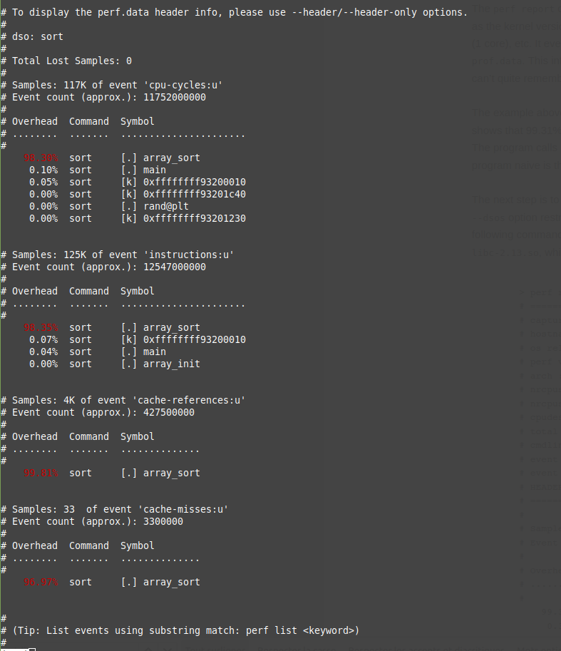
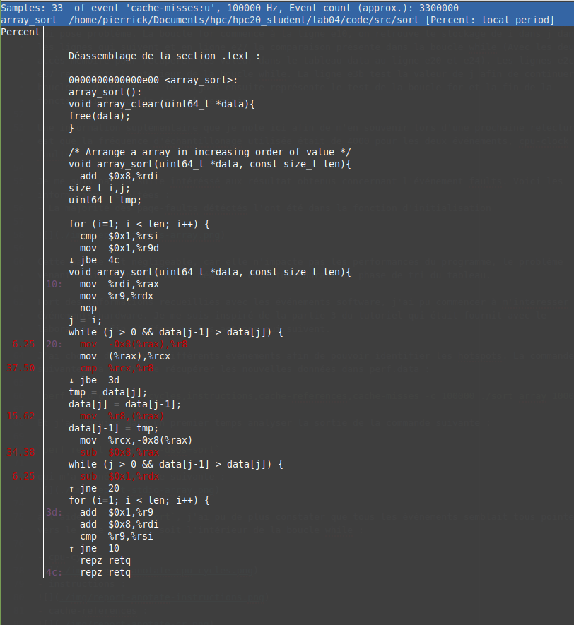

# Laboratoire 4 : Perf & Valgrind

### Pierrick Muller

### Introduction

J'ai eu un problème avec perf record, impossible d'annoter

résolution :
`sudo echo -1 | sudo dd of=/proc/sys/kernel/perf_event_paranoid`

Problème au démarage de perf report, manque des symboles

résolution :
`sudo echo 0 | sudo dd of=/proc/sys/kernel/kptr_restrict`

## Array

### Analyse

J'ai commencé par m'intéresser aux événements software suivants :
- cpu-clock, mesure le passage du temps en utilisant la clock du CPU comme source.
- faults, le nombre de page-faults rencontrés pendant l'exécution du programme.

J'ai donc lancé la commande suivante :
`time perf record -e cpu-clock,faults ./sort array 100000`

J'ai d'abord contrôler le ratio d'overhead que cette commande suscitait, en lançant le programme avec time une fois avec perf et une fois sans. J'ai pu calculer le ratio suivant :
(7.746−7.580)÷(7.580÷100) = 2.19

Sachant qu'un overhead aux alentour des 5% ou en dessous n'est généralement pas problématique, j'ai pu commencer à explorer les résultats.

J'ai ensuite utilisé la commande `perf report` afin de pouvoir analyser les données récupérées.
Je me suis concentré dans un premier temps sur la partie cpu-clock, et voici ce que j'ai pu en ressortir :
- La majorité du temps passé dans le programme l'est dans la fonction array_sort.  


- Le temps passé l'est dans la boucle while. Ici on nous indique que 54.88% du temps passé l'est dans la comparaison de la boucle while. Cependant. à cause du "skid", il est probable que l'instruction qui prend le plus de temps lors du programme n'est pas cette comparaison, mais une autre.


J'ai ensuite utilisé une autre commande afin d'y voir un peu plus clair et de ne pas être perturbé par les sources présentes : `perf annotate --stdio --dsos=sort --symbol=array_sort --no-source`

voici la sortie que j'ai pu obtenir :


On retrouve principalement les mêmes informations que dans l'image précédente, mais c'est toujours bien d'avoir une vue sur le code assembleur afin de pouvoir par la suite définir plus précisément ce qui pose problème. La boucle for commence à la ligne e10, on retrouve le stockage de i dans j dans les lignes qui suivent et en ligne e27 la comparaison présente dans la boucle while (Avec les deux accès mémoire pour récupérer les valeurs dans le tableau data aux lignes e20 et e24). Les lignes e2c à e37 représentent l'intérieur de la boucle while. La ligne e3b test la valeur de j afin de continuer la boucle ou d'arrêter et les lignes ensuite représente le test de la boucle for et la fin de la fonction si la boucle for est terminée.

Une information supplémentaire que je note ici afin de m'en souvenir lors d'une prochaine relecture est que la fréquence d'échantillonnage utilisée était de 4000 pour les deux événements, cpu-clock et faults.

Je me suis par la suite intéressé aux résultats obtenus concernant l'événement faults. Voici les informations récoltées :
- La majorité des page-faults détéctés l'ont été dans la fonction d'initialisation


Cette partie est négligeable, car elle n'impacte pas les performances du programme, le problème venant visiblement des accès mémoires effectués durant la phase de tri du tableau.

Fort des informations recueillies avec les événements software, j'ai pu commencer à m'intéresser aux événements hardware. Je me suis inspiré de la partie 3 du tutoriel qui était fournie avec le laboratoire afin d'effectuer les actions qui suivent.

J'ai choisi d'observer différents événements afin de pouvoir identifier les hotspots. La commande suivante m'a permis de récupérer les nouvelles données dans perf.data :

`perf record -e cpu-cycles,instructions,cache-references,cache-misses -c 100000 ./sort array 100000`

Et j'ai ensuite dans un premier temps analysé la sortie de la commande suivante :

`perf report --stdio --dsos=sort`

qui m'a donné la sortie suivante :


à l'aide de `perf report`, j'ai pu de plus constater que tous les événements semblaient tous pointer vers le même endroit, soit l'intérieur de la boucle while :

- cpu-cycles :

- instructions :

- cache-references :

- cache-misses :


À nouveau, à cause du "skid", il est for probable que ce ne soit pas la comparaison qui pose problème, mais bien les accès mémoires nécessaires avant cette comparaison.

Je suis par la suite passé à l'utilisation de valgrind afin de récupérer plus d'informations et afin de confirmer les informations déja acquises. J'ai utilisé la commande suivante :
`valgrind --tool=callgrind --simulate-cache=yes ./sort array 100000`

et j'ai obtenu la sortie suivante :

```
==25323==
==25323== Events    : Ir Dr Dw I1mr D1mr D1mw ILmr DLmr DLmw
==25323== Collected : 22670974647 5037237766 5020501720 1145 307828068 13184 1124 2098 13079
==25323==
==25323== I   refs:      22,670,974,647
==25323== I1  misses:             1,145
==25323== LLi misses:             1,124
==25323== I1  miss rate:           0.00%
==25323== LLi miss rate:           0.00%
==25323==
==25323== D   refs:      10,057,739,486  (5,037,237,766 rd + 5,020,501,720 wr)
==25323== D1  misses:       307,841,252  (  307,828,068 rd +        13,184 wr)
==25323== LLd misses:            15,177  (        2,098 rd +        13,079 wr)
==25323== D1  miss rate:            3.1% (          6.1%   +           0.0%  )
==25323== LLd miss rate:            0.0% (          0.0%   +           0.0%  )
==25323==
==25323== LL refs:          307,842,397  (  307,829,213 rd +        13,184 wr)
==25323== LL misses:             16,301  (        3,222 rd +        13,079 wr)
==25323== LL miss rate:             0.0% (          0.0%   +           0.0%  )
```

En utilisant kcachegrind, j'ai pu observer la chose suivante :


Cet outil me permet de voir les différents événements ainsi que l'endroit au niveau du code sources où ces événements ont eu lieu. En premier lieu, on peut voir que 99.09 % du programme se déroule dans la fonction array_sort (voir à gauche de l'image, dans la colonne propre). En prenant dans l'ordre, on peut observer où ont lieu les événements dans le code source. Je me suis intéressé aux trois types d'évènements suivants :

- Accès en lecture des données

- Accès en écriture des données

-Défaut de lecture de données du cache L1


On peut noter que la plupart tous les défauts en lecture de données du cache L1 proviennent de la condition while. En effet, vu que le premier accès mémoire à data[j-1] et data[j] se fait dans cette condition, c'est donc ici que le défaut de lecture arrive, car ensuite la donnée est stockée en cache L1 lors de la prochaine lecture. A noter tout de même que la donnée est présente en cache L2 suite probablement à l'initialisation (array_init). De plus, il peut être intéressant de noter que la partie accès en lecture des données ne prend en compte que les lectures effectuées dans la condition, ce qui impliquerait que ce type d'événement ne considère pas la lecture en cache comme un événement de type "Accès en lecture des données".

Fort de ces informations, j'ai pu imaginer la/les améliorations suivantes pour le programme.

### Conclusion sur les améliorations possibles

Comme vu plus haut, la problématique principale vient de la fonction array_sort, et principalement des accès mémoires effectués dans la boucle while qui effectue le tri. Je recopie la fonction ci-dessous afin de pouvoir en discuter.

```
/* Arrange a array in increasing order of value */
void array_sort(uint64_t *data, const size_t len){
        size_t i,j;
        uint64_t tmp;

        for (i=1; i < len; i++) {
                j = i;
                while (j > 0 && data[j-1] > data[j]) {
                        tmp = data[j];
                        data[j] = data[j-1];
                        data[j-1] = tmp;
                        j--;
                }
        }
}
```

L'algorithme est je pense figé, j'ai choisi de mettre en place un tri par insertion et modifier le type de tri reviendrait à dénaturer la nature de l'exercice je pense. Par contre, que je vois une amélioration possible dans l'implémentation de la boucle while. En effet, lors d'une itération de boucle , nous effectuons deux lectures dans la condition, deux lectures dans le corps et deux écritures dans le corps. Hors, ce nombre peut être réduit je pense. Dans le cas de notre fonction de tri, nous sommes "memory bound".

En modifiant le code comme ci-dessous, nous pourrions déjà réduire le nombre de lecture effectué par deux (Bien que normalement, la donnée que l'on lit dans le corps est déja en cache, cet ajout permet quand même de réduire le temps nécessaire au fonctionnement du programme.) :
```
/* Arrange a array in increasing order of value */
/*Version 2 , with less memory access */
void array_sort(uint64_t *data, const size_t len){
        size_t i,j;
        uint64_t tmp,tmp2;

        for (i=1; i < len; i++) {
                j = i;
                tmp = data[j];
                tmp2 = data[j-1];
                while (j > 0 && tmp2 > tmp) {
                        data[j] = tmp2;
                        data[j-1] = tmp;
                        j--;
                        tmp = data[j];
                        tmp2 = data[j-1];
                }
        }
}
```

Après avoir effectué cette modification, j'ai utilisé la commande time pour comparer les deux exécutions du programme, en utilisant cette commande 5 fois dans les deux cas , j'ai obtenu les valeurs suivantes :

commande : `time ./sort array 100000`

| Itération  | sort_array de base (total s)  | sort_array modifié (total s) | ratio d'amélioration |
|---|---|---|---|
| 1  | 7.588  | 4.808  | 1.578 |
| 2  | 7.599  | 4.706  | 1.615 |
| 3  | 7.594  | 4.650  | 1.633 |
| 4  | 7.546  | 4.713  | 1.601 |
| 5  | 7.591  | 4.757  | 1.596 |

On voit donc une très nette amélioration en terme de temps d'exécution du programme.

Un autre indicateur intéressant peut être trouvé sur deux événements que j'ai pu voir sur kcachegrind :
- Accès en lecture des données et défaut de lecture de données du cache L1


La lecture et les défauts de lecture se sont déplacé tous sur la lecture de data[j-1] (sauf nouvelle itération de la boucle for). En comparant les résultats en valeur absolue, on observe la chose suivante :
- version 1

- version 2


Si on peut voir que le nombre de défauts de lecture l1 est stable (légèrement plus élevé), le nombre de lecture de données à lui était divisé par deux. Le gain en terme de temps se trouve ici, comme l'on pouvait s'y attendre.

La fonction finale présentée dans ce document se retrouve commentée dans le fichier array_util.c

Voici qui clôt la partie array du programme et les améliorations possible qui pouvaient être apportées selon moi.

## List

### Analyse

Je ne détaillerais pas ici autant que dans la partie array les démarches mises en place pour récupérer les informations, mais je parlerais principalement des éléments et informations importantes qui ont pu être trouvée durant l'analyse. Je note ici aussi que j'ai réduit le nombre d'éléments dans le tableau, de 100000 à 50000, afin de pouvoir étudier le programme sans perdre trop de temps lors des exécutions de ce dernier.

Première commande : `time perf record -e cpu-clock,faults ./sort list 50000`

Calcul du ratio de l'overhead : (19.226÷19.163)÷(19.163÷100) = 5.2355

Comme on est à peu prêt aux alentours de 5%, on peut continuer.

Premières informations avec `perf report`:

- Le programme ne passe pas tout son temps dans la fonction de tri cette fois. Il passe la moitié de son temps dans la fonction de tri, un quart de son temps à initialiser la liste et un quart de son temps à nettoyer la mémoire.


- Concernant la fonction sort, les problèmes de performances viennent principalement de l'intérieur de la boucle while qui permet le tri. À nouveau, à cause du "skid", il est dur de déterminer exactement d'où vient le problème de performance, mais on peut déja se douter que les multiples accès mémoires sont problématiques.


- Pour ce qui est de la fonction clear, la lecture est un peu complexe pour le moment. Je vais essayer par la suite de mieux identifier le problème en utilisant l'option --no-source lors de l'utilisation de la commande `perf annotate`.


- Enfin, pour la fonction init, on se retrouve un peu dans le même cas que pour la fonction clear.


A l'aide de la commande `perf annotate --stdio --dsos=sort --symbol=<nom_fonction> --no-source`, j'ai pu y voir plus clair pour les fonctions list_clear et list_init :

- list_clear


C'est la partie cd0 à cdd qui nous intéresse. En effet, cette partie représente la boucle suivante :
```
while(current->next->next != NULL)
{
        current = current->next;
}
```
On comprend assez vite que le fait de parcourir toute la liste pour à chaque clear peut être problématique.

- list_init


On s'intéresse ici à la partie c50 à c5c. En réalité, cette partie de code correspond à une autre fonction, list_push, et plus précisément à une boucle contenue dans cette fonction :
```
while(current->next != NULL)
{
        current = current->next;
}
```
Comme auparavant, pour ajouter un élément ici on parcourt toute la liste afin de l'ajouter à la fin.

J'ai à nouveau utilisé la commande qui avait été utilisé dans la partie concernant les array :

`perf record -e cpu-cycles,instructions,cache-references,cache-misses -c 100000 ./sort list 50000`

J'ai utilisé perf report afin d'analyser les résultats obtenus. Cependant, je ne mets pas les résultats en images ici, car tout n'est pas intéressant :
- cpu-cycles : correspond aux résultats obtenus avec cpu-clock

- instructions : correspond aux résultats obtenus avec cpu-clock

- cache-references : En terme de pourcentage interne à chaque fonction, correspond aux résultats obtenus avec cpu-clock. Par contre la répartition en pourcentage entre sort, init et clear est égale, contrairement auparavant.

- cache-misses : correspond aux résultats obtenus avec cpu-clock

Comme auparavant, j'ai utiliser valgrind, avec la commande suivante : `valgrind --tool=callgrind --simulate-cache=yes ./sort list 50000`

et la sortie suivante :
```
==1280==
==1280== Events    : Ir Dr Dw I1mr D1mr D1mw ILmr DLmr DLmw
==1280== Collected : 23243946216 6276185668 1265435827 1143 1875888316 418507 1125 2097 25577
==1280==
==1280== I   refs:      23,243,946,216
==1280== I1  misses:             1,143
==1280== LLi misses:             1,125
==1280== I1  miss rate:           0.00%
==1280== LLi miss rate:           0.00%
==1280==
==1280== D   refs:       7,541,621,495  (6,276,185,668 rd + 1,265,435,827 wr)
==1280== D1  misses:     1,876,306,823  (1,875,888,316 rd +       418,507 wr)
==1280== LLd misses:            27,674  (        2,097 rd +        25,577 wr)
==1280== D1  miss rate:           24.9% (         29.9%   +           0.0%  )
==1280== LLd miss rate:            0.0% (          0.0%   +           0.0%  )
==1280==
==1280== LL refs:        1,876,307,966  (1,875,889,459 rd +       418,507 wr)
==1280== LL misses:             28,799  (        3,222 rd +        25,577 wr)
==1280== LL miss rate:             0.0% (          0.0%   +           0.0%  )
```

J'ai utilisé kcachegrind afin de visualiser les résultats, j'ai pris une à une les différentes fonctions afin de les analyser :

- list_sort
  - Accès en lecture/écriture des données
  
  - Défaut de lecture de données du cache L1
  

- list_init
  
- list_clear
  

Ce qui ressort de ces données, c'est que les accès mémoire représentent un problème. Il faut travailler sur les trois fonctions afin d'améliorer les performances globales du programme.

### Conclusion sur les améliorations possibles

Je vais maintenant prendre chacune des fonctions qui ont été identifiée comme problématique et tenter de résoudre les problèmes. Notre programme est "memory bound".

##### list_sort
C'est la fonction dans laquelle le programme passe le plus de temps. Je m'intéresserais ici à la boucle while ci-dessous, car c'est là que le programme passe le plus de temps :
```
while (ptr1->next != lptr)
{
        /*
         * If the value of the actual element is greater then the value of the next
         * element, we swap them (We swap the value )
         */
        if (ptr1->data_value > ptr1->next->data_value)
        {
                temp_val = ptr1->data_value;
                ptr1->data_value = ptr1->next->data_value;
                ptr1->next->data_value = temp_val;
                swapped = 1;
        }
        ptr1 = ptr1->next;
}
```
J'ai pensé comme pour la première partie qu'effectuer la modification suivante permettrait de réduire le nombre de lecture, cependant, après avoir testé la modification, j'ai vu que le problème était juste déplacé, et non pas supprimé.

```
//Version 2 ameliorée pour laboratoire 4
temp_val = ptr1->data_value;
while (ptr1->next != lptr)
{

        //If the value of the actual element is greater then the value of the next
        //element, we swap them (We swap the value )

        temp_val2 = ptr1->next->data_value;
        if (temp_val > temp_val2)
        {
                ptr1->data_value = temp_val2;
                ptr1->next->data_value = temp_val;
                swapped = 1;
        }
        else
        {
                temp_val = temp_val2;
        }
        ptr1 = ptr1->next;

}
```

Je n'ai pas pu identifier d'autres moyens de modifications de la fonction list_sort permettant sans modifier l'algorithme de diminuer l'impact sur les performances. Je me suis donc concentré sur les deux autres fonctions, list_init et list_clear.

##### list_init

La partie suivante est la partie problèmatique dans la fonction list_init :
```
struct list_element *head = (struct list_element*) malloc(sizeof(struct list_element));
head->data_value = (uint64_t)rand();
//We add all the element needed in function of the len argument
for(i = 0; i < len; i++)
{
        list_push(head, (uint64_t)rand());
}
```
 Le problème venait du fait que list_push parcourait à partir de head l'intégralité de la liste pour ajouter un élément à la fin. Voici la modification que j'ai apporté afin de résoudre le problème :
```
struct list_element *head = (struct list_element*) malloc(sizeof(struct list_element));
struct list_element *temp_head;
head->data_value = (uint64_t)rand();
temp_head = head;
//We add all the element needed in function of the len argument
for(i = 0; i < len; i++)
{
        list_push(temp_head, (uint64_t)rand());
        temp_head = temp_head->next;
}
```
Cette modification assure que push puisse ajouter directement l'élément à la fin de la liste.

###### list_clear
La partie suivante est la partie problématique dans la fonction list_clear :
```
struct list_element* current = NULL;
while(head->next != NULL)
{
        current = head;
        while(current->next->next != NULL)
        {
                current = current->next;
        }
        free(current->next);
        current->next = NULL;
}
free(head);
```

Le problème vient encore une fois du fait que la liste est parcourue en entière à chaque free. J'ai modifié le code de la manière suivante afin de résoudre ce problème :
```
struct list_element* current = NULL;
while(head->next != NULL)
{
        current = head;
        head = head->next;
        free(current);
}
free(head);
```
Cette modification assure que la liste est parcourue une seule fois.

Après ces modifications, j'ai effectué le même test qu'auparavant avec la commande time, voici les résultats obtenus :

| Itération  | sort list de base (total s)  | sort list modifié (total s) | ratio d'amélioration |
|---|---|---|---|
| 1  | 19.263 | 10.681  | 1.803 |
| 2  | 19.448 | 10.908  | 1.783 |
| 3  | 19.104 | 10.857  | 1.759 |
| 4  | 19.124 | 10.858  | 1.761 |
| 5  | 19.169 | 10.823  | 1.771 |

Et en observant kcachegrind, on peut voir la chose suivante :

- Ancien programme


- Programme avec les modifications


On peut voir une nette diminution à la fois des défauts de lectures du cache l1 et du nombre d'accès en lecture lors de list_init et list_clear. Plus étonnant, on peut voir une diminution aussi du nombre de lecture pour list_sort, ce qui n'était pas le cas auparavant. Je n'ai pas réussi à déterminer les causes de cette baisse soudaine.


Toutes les améliorations de code sont présentes en commentaire dans le code fournit avec ce rapport.


###### Pierrick Muller, le 01.04.2020
