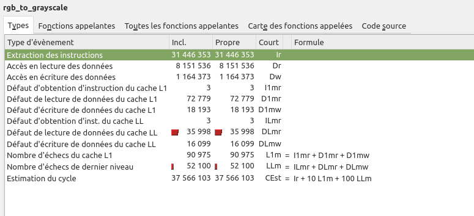
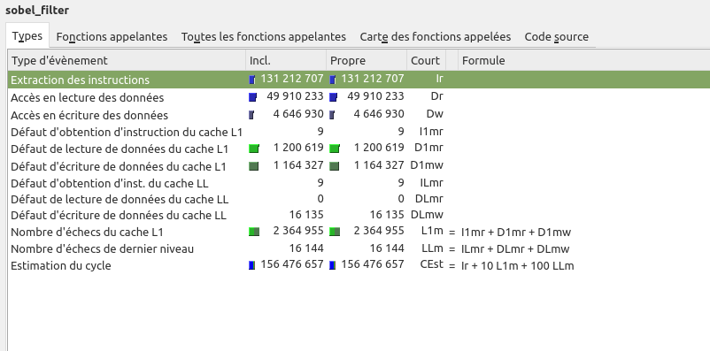
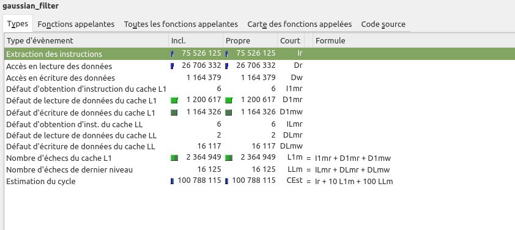
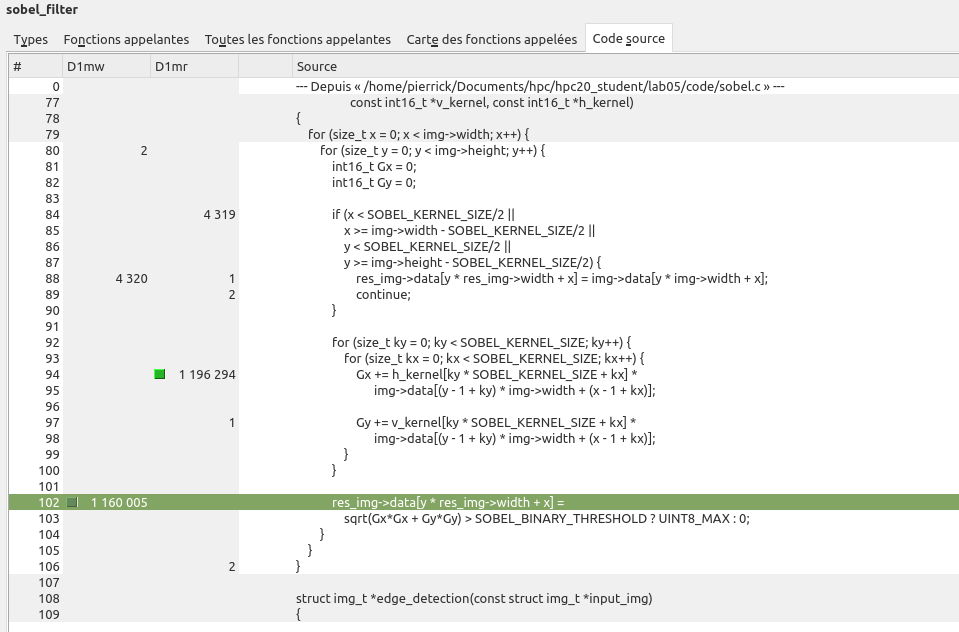
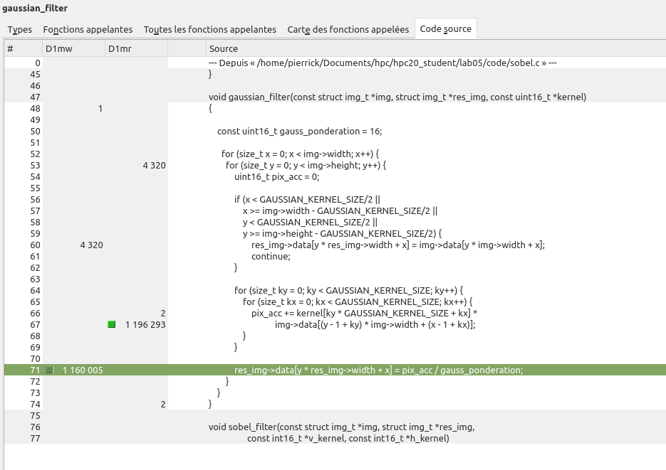
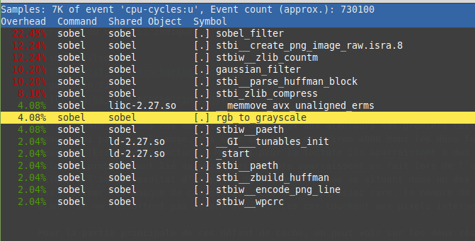
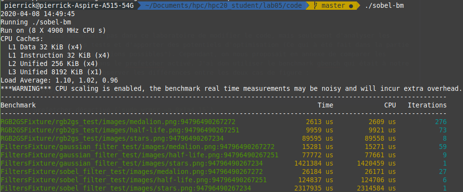
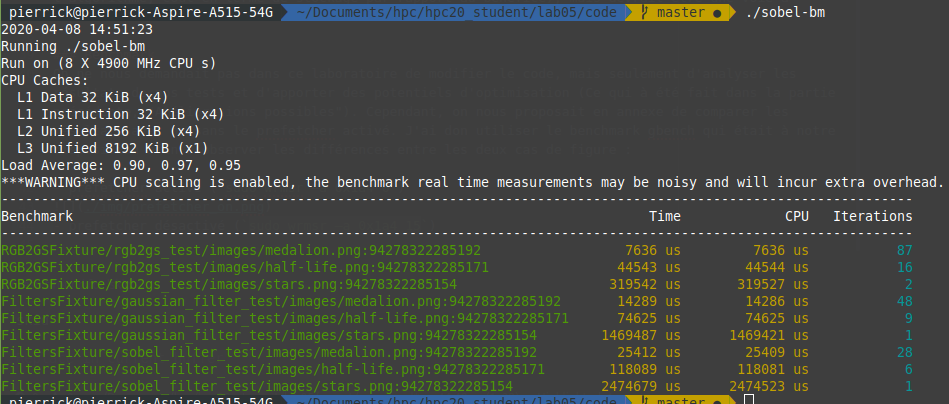

# Laboratoire 5 : Convolution (Partie 1)

### Pierrick Muller

### Analyse des performances
J'ai utilisé l'outil vallgrind afin d'analyser les performances des trois fonctions qui nous intéressait. La commande utilisée était la suivante :
```
valgrind --tool=callgrind --simulate-cache=yes ./sobel images/medalion.png images/edge_medalion.png
```
Et le résultat visualisé à l'aide du programme kcachegrind était le suivant pour chacune des trois fonctions que nous devions analyser :
- rgb_to_grayscale

- sobel_filter

- gaussian_filter


J'ai choisi de commencer par m'intéresser aux deux fonctions de filtre, qui présente vraisemblablement le même problème de performance, soit la gestion de l'accès aux données (écriture comme lecture) en cache L1. Voici ci-dessous les deux codes sources avec les défauts de lecture/écriture du cache L1 indiqués :

- sobel_filter

- gaussian_filter


Tout d'abord, parlons des défauts qui ont lieu aux alentours des premiers tests effectués dans les boucles qui parcourent l'image. Ils sont au nombre d'environ 4000 dans les deux fonctions et dans les deux cas (Ecriture et lecture). Même si pour la lecture ils apparaissent à des endroits différents, cela est probablement lié au skid. Ces défauts apparaissent en fait lors de l'assignation de la valeur à l'image résultat d'un pixel de l'image de base se situant dans un des bords et ne pouvant pas utiliser les masques de convolution. Ces cas étant assez rares, le nombre de défauts de lecture y étant lié ne ressort pas autant que pour les cas touchant aux pixels internes à l'image.

Pour la partie principale de ces défauts de cache, on peut voir sur les deux résultats en image qu'ils arrivent lors des différentes lectures sur l'image de base et lors de l'écriture sur l'image résultat. Cela nous indique que si l'on veut améliorer les performances de ces deux fonctions, nous devons nous concentrer sur la façon dont les données sont accédées afin d'optimiser l'utilisation de la cache l1. En observant la boucle principale (Celles permettant de modifier les valeurs de x et y), on peut voir que dans les deux cas, on itère au travers de toute la hauteur pour une position en longueur. Or, lors de l'accès aux données , en lecture comme en écriture, cette méthode ne permet pas d'utiliser le principe de localité afin d'optimiser notre cache. En effet, étant donnée que les données sont stockées dans le tableau data sous la forme ("position Hauteur" * "longueur" + "position longueur"), on se retrouve en itérant sur chaque position de hauteur avant de changer de position de longueur avec des accès mémoire qui sont éloignés à chaque itération d'une longueur complète. Or comme la cache utilise lors du chargement d'une donnée le principe de localité et donc charge aussi les données proches de la donnée qui doit être utilisée, cette façon d'itérer ne permet pas de profiter de ce principe. C'est là que se trouve le problème de performance dans le cadre de ces deux fonctions.

Passons maintenant à la première fonction (rgb_to_grayscale). On peut voir que ce qui ressort principalement , c'est le nombre de défauts de lecture du cache LL. Cela n'est pas étonnant, étant donnée que cette fonction est la première à être appelée lors du traitement de l'image. Ainsi, bien que la fonction fasse bon usage du cache L1 en itérant sur toute la longueur pour une position en hauteur, et donc en profitant du principe de localité, les défauts de lecture et d'écriture de données du cache LL viennent du fait que les données en question n'étaient pas encore chargées en cache et doivent donc être récupérés depuis la mémoire principale. De ce fait, cette fonction ne peut pas à mon sens être optimisé et en observant à l'aide de perf le nombre de cpu cycles par fonction, on observe que cette fonction prend moins de temps que les deux autres fonctions afin de s'exécuter :

Dès lors, je pense la laisser de coté pour les améliorations possibles étant donné que je n'en voit pas, que l'impact sur le programme n'est pas probant et que les données doivent de toute façon être chargées depuis la mémoire en cache à un moment donnée.

### Améliorations possibles
J'ai vu deux améliorations possibles concernant les fonctiona sobel_filter et gaussian_filter, les deux étant liés à l'accès au cache L1.
- La première possibilité que je vois est de modifier simplement l'ordre des deux boucles qui modifie x et y afin de pouvoir parcourir toute la longueur d'une position en hauteur et donc traiter les données étant le plus proche dans la mémoire en un coup. Cela permettra de profiter du principe de localité dans la cache afin de diminuer le nombre de défauts de cache l1, car les données seront bel et bien stockées en cache l1 grace au principe de localité. Cette modification peut être effectuée dans les deux fonctions (sobel_filter et gaussian_filter) de la même façon, et sans devoir modifier d'autre parties du code.

- La deuxième modification pousse un peu plus loin l'idée et propose de limiter le nombre d'accès mémoire lors de l'application du filtre. En effet, dans les deux cas, une deuxième série de doubles boucles internes permet de calculer différentes valeurs qui seront utiles pour remplir l'image résultante de la fonction (pix_acc pour le filtre gaussien et Gx/Gy pour le filtre sobel). Or, certains des calculs qui sont additionnés pour former ces valeurs devraient pouvoir être mémorisé afin de servir pour le pixel suivant. Je m'explique : si l'on doit calculer ces valeurs en fonction des pixels environnant le pixel de l'image que nous sommes en train de traiter, certains de ces pixels seront par la suite réutilisés pour le pixel d'après. Dans le cadre du nouvel algorithme qui consisterait à traiter les pixels lignes par lignes (En remplaçant x et y, comme dis plus haut), les résultats des calculs effectués pour les pixels supérieur milieu, supérieur gauche, inférieur gauche et inférieur milieu pourraient être réutilisés afin de remplir directement les valeurs de nouveaux résultats pour les pixels supérieur droite, supérieur milieu, inférieur milieu et inférieur gauche respectivement. En poussant plus loin, les nouveaux pixels supérieur milieu et inférieur milieu deviennent les pixels supérieur droite et inférieur milieu du résultats suivant. Bien sure, cette possibilité d'amélioration apporte de nouveaux problèmes (Plus de tests à effectuer, réflexion sur l'algorithme, coût en terme de stockage par rapport au bénéfice), mais devrait être une voie à explorer pour l'avenir. Je note tout de même que cette solution pourrait au final ralentir le programme, car le coût en terme de stockage de ces résultats pourrait être plus grand que le coût du calcul + de la lecture de la valeur du pixel. Cependant, une approche consistant à stocké les valeurs des pixels qui sont traités pour plusieurs itérations et ensuite à effectuer les calculs à nouveau à chaque fois devrait être au moins explorée.

### Benchmark
On ne nous demandait pas dans ce laboratoire de modifier le code, mais seulement d'analyser les résultats de nos tests et d'apporter des potentiels d'optimisation (Ce qui a été fait dans la partie précédente, "Améliorations possibles"). Cependant, on nous proposait en annexe de comparer les résultats avec ou sans le prefetcher activé. J'ai don utiliser le benchmark gbench qui était à notre disposition afin d'observer les différences entre les deux cas de figure :

- prefetcher activé (`sudo wrmsr –a 0x1a4 0`)

- prefetcher désactivé (`sudo wrmsr –a 0x1a4 15`)


On voit principalement une différence concernant la fonction rgb_to_grayscale, en terme de temps d'exécution, qui est plus long avec le prefetcher désactivé. Cela vient du fait que cette fonction était la seule des trois fonctions que nous devions analyser qui utilisait la cache correctement. Ainsi, l'impact de la désactivation du prefetcher ne se ressent pas pour les deux autres fonctions. Le fait que la désactivation du prefetcher entraîne de mauvaises performances pour la première fonction vient du fait que dans l'incapacité de ce dernier à pouvoir reconnaître les patterns de cache-miss, le cpu ne peut rien y faire et le code écrit de manière à optimiser l'utilisation de la cache ne peut pas en profiter.

###### Pierrick Muller, le 08.04.2020
