# Laboratoire 6 : Convolution (Partie 2)

### Pierrick Muller

### Récupération des résultats du code de base sur le serveur
J'ai commencé par récupérer le résultat sur le serveur de l'exécution du code de base afin d'avoir un point de départ :
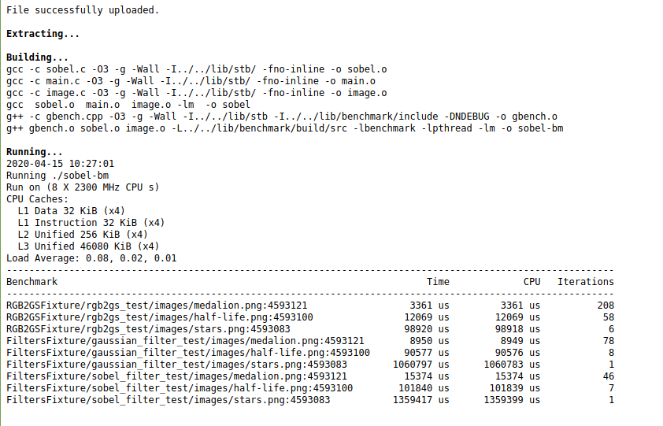

### Mise en oeuvre des améliorations possibles
J'ai commencé par prendre les deux améliorations possibles que j'avais identifiées dans le laboratoire précédent afin de les appliquer à mon code. J'ai tout d'abord modifié le code en inversant dans les fonctions sobel_filter et gaussian_filter les deux boucles principales qui permettent de parcourir l'image afin d'optimiser la lecture des informations en cache en traitant les données les plus proches à la suite :

ancienne version (sobel.c)
```
void gaussian_filter(const struct img_t *img, struct img_t *res_img, const uint16_t *kernel)
{

    const uint16_t gauss_ponderation = 16;

    for (size_t x = 0; x < img->width; x++) {
        for (size_t y = 0; y < img->height; y++) {

          ... code non touché

void sobel_filter(const struct img_t *img, struct img_t *res_img,
                  const int16_t *v_kernel, const int16_t *h_kernel)
{
    for (size_t x = 0; x < img->width; x++) {
        for (size_t y = 0; y < img->height; y++) {

          ... code non touché

```
nouvelle version(sobel.c)
```
void gaussian_filter(const struct img_t *img, struct img_t *res_img, const uint16_t *kernel)
{

    const uint16_t gauss_ponderation = 16;

    for (size_t y = 0; y < img->height; y++) {
        for (size_t x = 0; x < img->width; x++) {

          ... code non touché

void sobel_filter(const struct img_t *img, struct img_t *res_img,
                  const int16_t *v_kernel, const int16_t *h_kernel)
{
    for (size_t y = 0; y < img->height; y++) {
        for (size_t x = 0; x < img->width; x++) {

          ... code non touché

```

J'ai par la suite relancé le benchmark :
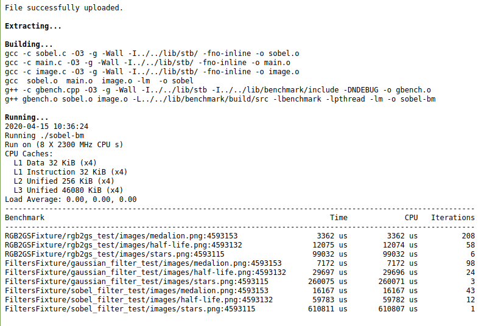

Grâce à la meilleure utilisation de la cache, on a pu réduire significativement le temps passé dans les deux fonctions de filtre.

J'ai par la suite voulu implémenter la deuxième proposition que j'avais fait, c'est à dire le fait de mémoriser les pixels importants pour les prochains calculs une fois qu'on a dû y accéder en mémoire.
Pour ce faire, j'ai dû réfléchir à l'algorithme et aux différents cas de figures pour chaque pixel. Je me suis de plus inspiré de la vidéo suivante :

https://www.youtube.com/watch?v=3uiEyEKji0M&feature=youtu.be&t=380

Je me suis rendu compte que ce que je souhaitais implémenter ressemblait beaucoup à la troisième solution apportée sans utiliser de thread, celle impliquant une mauvaise utilisation du parallélisme. Dans ce laboratoire, étant donnée qu'on ne nous demande pas d'utiliser de threads, et que notre programme semble memory bound, cette solution permet d'apporter normalement un gain en performances. J'ai choisi de m'intéresser pour le moment uniquement à la fonction gaussian_filter , car l'implémentation de la méthode résultante pour la fonction sobel_filter ne devrait pas énormément changer. Voici la fonction après modification des boucles faites précédemment :

```
void gaussian_filter(const struct img_t *img, struct img_t *res_img, const uint16_t *kernel)
{

    const uint16_t gauss_ponderation = 16;

    /*for (size_t x = 0; x < img->width; x++) {
        for (size_t y = 0; y < img->height; y++) {*/
      for (size_t y = 0; y < img->height; y++) {
        for (size_t x = 0; x < img->width; x++) {
            uint16_t pix_acc = 0;

            if (x < GAUSSIAN_KERNEL_SIZE/2 ||
                x >= img->width - GAUSSIAN_KERNEL_SIZE/2 ||
                y < GAUSSIAN_KERNEL_SIZE/2 ||
                y >= img->height - GAUSSIAN_KERNEL_SIZE/2) {
                    res_img->data[y * res_img->width + x] = img->data[y * img->width + x];
                    continue;
            }

            for (size_t ky = 0; ky < GAUSSIAN_KERNEL_SIZE; ky++) {
                for (size_t kx = 0; kx < GAUSSIAN_KERNEL_SIZE; kx++) {
                    pix_acc += kernel[ky * GAUSSIAN_KERNEL_SIZE + kx] *
                               img->data[(y - 1 + ky) * img->width + (x - 1 + kx)];
                }
            }

            res_img->data[y * res_img->width + x] = pix_acc / gauss_ponderation;
        }
    }
}

```
J'ai tout d'abord commencé par rapatrier les hauteurs et longueur utilisés par les images en local afin de diminuer le nombre d'accès mémoire. J'ai ainsi obtenu une légère amélioration au niveau du benchmark pour la fonction gaussian filter :
```
void gaussian_filter(const struct img_t *img, struct img_t *res_img, const uint16_t *kernel)
{

    const uint16_t gauss_ponderation = 16;
    int img_width = img->width;
    int res_img_width = res_img->width;
    int height = img->height;
    /*for (size_t x = 0; x < img->width; x++) {
        for (size_t y = 0; y < img->height; y++) {*/
      for (size_t y = 0; y < height; y++) {
        for (size_t x = 0; x < img_width; x++) {
            uint16_t pix_acc = 0;

            if (x < GAUSSIAN_KERNEL_SIZE/2 ||
                x >= img_width - GAUSSIAN_KERNEL_SIZE/2 ||
                y < GAUSSIAN_KERNEL_SIZE/2 ||
                y >= height - GAUSSIAN_KERNEL_SIZE/2) {
                    res_img->data[y * res_img_width + x] = img->data[y * img_width + x];
                    continue;
            }

            for (size_t ky = 0; ky < GAUSSIAN_KERNEL_SIZE; ky++) {
                for (size_t kx = 0; kx < GAUSSIAN_KERNEL_SIZE; kx++) {
                    pix_acc += kernel[ky * GAUSSIAN_KERNEL_SIZE + kx] *
                               img->data[(y - 1 + ky) * img_width + (x - 1 + kx)];
                }
            }

            res_img->data[y * res_img_width + x] = pix_acc / gauss_ponderation;
        }
    }
}
```

résultat benchmark :
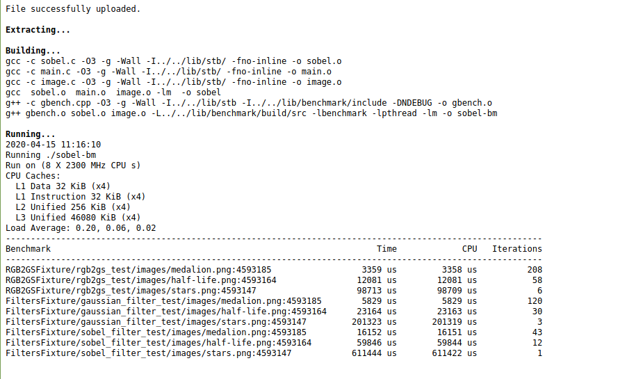

J'ai par la suite réflchi à comment étaient effectués les calculs de convolution pour un pixel. Plusieurs choses en sont ressorti :

- Les pixels se situant sur le bord immédiat de l'image sont simplement copiés dans l'image résultat.

- Pour un pixel ne rentrant pas dans la case ci-dessus, une chose est sure : les 3 pixels supérieurs nécessaires au calcul de la convolution auront déjà été lu en mémoire au moins une fois (Soit parce qu'il s'agissait d'un pixel de bord, soit parce qu'il aura été utilisé dans un calcul de convolution au moins une fois auparavant)

L'idée à partir de la était de fournir une première amélioration brute permettant d'avoir une base pour minimiser ensuite encore les accès redondant à un pixel en cache. En gardant les valeurs de ces pixels dans un tableau local, on peut éviter ce genre de problème de redondance. De plus, cela implique d'effectuer une copie finale dans l'image résultante. Voici le code résultant de cette amélioration :

```
void gaussian_filter(const struct img_t *img, struct img_t *res_img, const uint16_t *kernel)
{

    const uint16_t gauss_ponderation = 16;
    int img_width = img->width;
    int res_img_width = res_img->width;
    int height = img->height;
    uint8_t *datas;
    datas = (uint8_t *) malloc(sizeof(uint8_t)*res_img_width*height);

    /*for (size_t x = 0; x < img->width; x++) {
        for (size_t y = 0; y < img->height; y++) {*/

      for (size_t y = 0; y < height; y++) {
        for (size_t x = 0; x < img_width; x++) {
            uint16_t pix_acc = 0;

            if (x < GAUSSIAN_KERNEL_SIZE/2 ||
                x >= img_width - GAUSSIAN_KERNEL_SIZE/2 ||
                y < GAUSSIAN_KERNEL_SIZE/2 ||
                y >= height - GAUSSIAN_KERNEL_SIZE/2) {
                    datas[y*res_img_width + x] = img->data[y * img_width + x];
                    /*res_img->data[y * res_img_width + x] = img->data[y * img_width + x];*/
                    continue;
            }

            for (size_t ky = 0; ky < GAUSSIAN_KERNEL_SIZE; ky++) {
                for (size_t kx = 0; kx < GAUSSIAN_KERNEL_SIZE; kx++) {
                  if(ky == 0)
                  {
                    pix_acc += kernel[ky * GAUSSIAN_KERNEL_SIZE + kx] *
                               datas[(y - 1 + ky) * img_width + (x - 1 + kx)];
                  }
                  else
                  {
                    pix_acc += kernel[ky * GAUSSIAN_KERNEL_SIZE + kx] *
                               img->data[(y - 1 + ky) * img_width + (x - 1 + kx)];
                  }
                }
            }

            datas[y * res_img_width + x] = pix_acc / gauss_ponderation;
        }
    }
    for (size_t y = 0; y < height; y++) {
      for (size_t x = 0; x < img_width; x++) {
        res_img->data[y * res_img_width + x] = datas[y * res_img_width + x];
      }
    }

}
```

Et voici le résultat du benhmark :
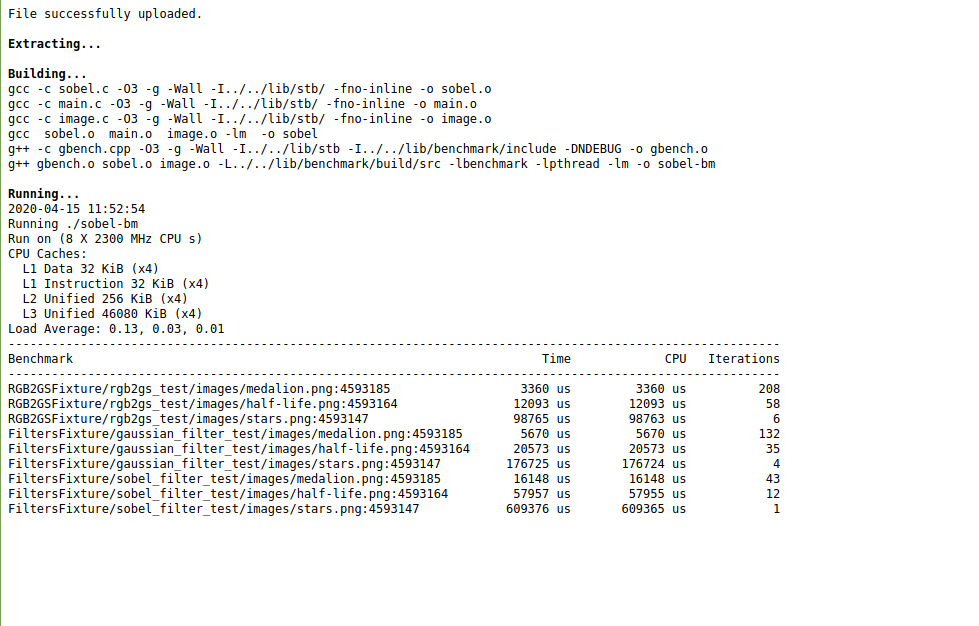


Cette approche c'est toutefois révélée fausse. En effet, dans le code ci-dessus, les pixels réutilisés ont été modifié par la convolution(A l'exception de la première ligne de l'image), et donc ne peuvent pas être réutilisés.

À partir de la, j'ai voulu tenter une autre approche. Je me suis dit que lorsqu'on calcule pix_acc, certains pixels pourraient être mémorisés pour le prochain calcul de convolution.

En effet, tous les pixels de la colonne centrale et de la colonne gauche peuvent être réutilisés

Dès lors, j'ai voulu utiliser cette propriété pour minimiser le nombre d'accès aux données. J'ai donc commencé par ce qui semblait être le plus facile et pertinent afin de tester, soit la mémorisation  des pixels supérieurs et inférieurs centraux et droite à chaque convolution :
```
void gaussian_filter(const struct img_t *img, struct img_t *res_img, const uint16_t *kernel)
{

    const uint16_t gauss_ponderation = 16;
    int img_width = img->width;
    int res_img_width = res_img->width;
    int height = img->height;

    /*for (size_t x = 0; x < img->width; x++) {
        for (size_t y = 0; y < img->height; y++) {*/

      for (size_t y = 0; y < height; y++) {
        uint16_t pix_acc_fut = 0;
        for (size_t x = 0; x < img_width; x++) {
            uint16_t pix_acc = 0;

            uint8_t temp = 0;


            if (x < GAUSSIAN_KERNEL_SIZE/2 ||
                x >= img_width - GAUSSIAN_KERNEL_SIZE/2 ||
                y < GAUSSIAN_KERNEL_SIZE/2 ||
                y >= height - GAUSSIAN_KERNEL_SIZE/2) {

                    res_img->data[y * res_img_width + x] = img->data[y*res_img_width + x];
                    continue;
            }

            //SI second pixel d'une ligne
            if(x < GAUSSIAN_KERNEL_SIZE/2 + 1))
            {
              for (size_t ky = 0; ky < GAUSSIAN_KERNEL_SIZE; ky++)
              {
                  for (size_t kx = 0; kx < GAUSSIAN_KERNEL_SIZE; kx++)
                  {

                    temp = img->data[(y - 1 + ky) * img_width + (x - 1 + kx)];
                    pix_acc += kernel[ky * GAUSSIAN_KERNEL_SIZE + kx] *
                                 temp;
                    if(kx != 0)
                    {
                      pix_acc_fut += kernel[ky * GAUSSIAN_KERNEL_SIZE + (kx-1)]*
                                     temp;
                    }
                  }
                }
              }
              //Si avant-dernier pixel d'une ligne
              else if (x >= img_width - GAUSSIAN_KERNEL_SIZE/2 - 1 )
              {
                pix_acc += pix_acc_fut;
                pix_acc_fut = 0;
                for (size_t ky = 0; ky < GAUSSIAN_KERNEL_SIZE; ky++)
                {
                  pix_acc += kernel[ky * GAUSSIAN_KERNEL_SIZE + 2] *
                               img->data[(y - 1 + ky) * img_width + (x + 1)];
                }
              }
              else
              {
                pix_acc += pix_acc_fut;
                pix_acc_fut = 0;
                for (size_t ky = 0; ky < GAUSSIAN_KERNEL_SIZE; ky++)
                {
                    for (size_t kx = 1; kx < GAUSSIAN_KERNEL_SIZE; kx++)
                    {
                      temp = img->data[(y - 1 + ky) * img_width + (x - 1 + kx)];
                      if(kx != 1)
                      {
                          pix_acc += kernel[ky * GAUSSIAN_KERNEL_SIZE + kx] *
                                       temp;
                      }
                      pix_acc_fut += kernel[ky * GAUSSIAN_KERNEL_SIZE + (kx-1)]*
                                     temp;
                    }
                  }
              }

            res_img->data[y * res_img_width + x] = pix_acc / gauss_ponderation;
        }
    }

}
```

Et voici le résultat du benchmark en résultant :
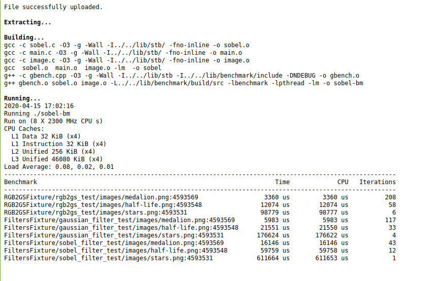

On peut voir une amélioration par rapport au dernier code fonctionnel en terme de temps pour le traitement d'images lourdes, mais le benchmark prend légèrement plus de temps pour des images plus petites qu'avant modification du code.

Cependant, dans l'algorithme ci-dessus, deux colonnes sont traitées à chaque fois, ce qui implique une redondance d'accès pour une des colonnes. En ajoutant une étape de calcul lors de la première phase (premier pixel), on peut s'assurer que chaque pixel de la ligne n'ait à accéder qu'à trois pixels (ceux de sa colonne droite), ce qui réduit encore le temps nécessaire à l'exécution du programme :

```
...
if(x < GAUSSIAN_KERNEL_SIZE/2 + 1)
{
        //si second pixel de seconde ligne
        for (size_t ky = 0; ky < GAUSSIAN_KERNEL_SIZE; ky++)
        {
                for (size_t kx = 0; kx < GAUSSIAN_KERNEL_SIZE; kx++)
                {
                        ...

                        if(kx != 0)
                        {
                                pix_acc_fut += kernel[ky * GAUSSIAN_KERNEL_SIZE + (kx-1)]*
                                               temp;
                                if(kx == 2)
                                {
                                        pix_acc_fut_2 += kernel[ky * GAUSSIAN_KERNEL_SIZE + (kx-2)]*
                                                         temp;
                                }
                        }
                }
        }
}
//Si avant-dernier pixel d'une ligne
else if (x >= img_width - GAUSSIAN_KERNEL_SIZE/2 - 1 )
{
      ...
}
else
{
        pix_acc += pix_acc_fut;
        pix_acc_fut = pix_acc_fut_2;
        pix_acc_fut_2 = 0;
        for (size_t ky = 0; ky < GAUSSIAN_KERNEL_SIZE; ky++)
        {

                temp = img->data[(y - 1 + ky) * img_width + (x + 1)];

                pix_acc += kernel[ky * GAUSSIAN_KERNEL_SIZE + 2] *
                           temp;

                pix_acc_fut += kernel[ky * GAUSSIAN_KERNEL_SIZE + (2-1)]*
                               temp;
                pix_acc_fut_2 += kernel[ky * GAUSSIAN_KERNEL_SIZE + (2-2)]*
                               temp;

        }
}
...
```
Et voici le résultat du benchmark :
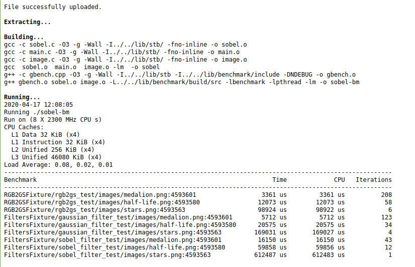

Comme l'on pouvait s'y attendre, une légère amélioration est visible.


Cette voie étant intéressante, nous pourrions tenter de la pousser un peu plus loin, en appliquant la même réflexion qui a été faite sur les colonnes de pixel et leurs calculs de convolution aux lignes. En effet, il est possible de pré-calculer une partie du résultat de la convolution pour les deux lignes inférieures au pixel qui est en cours de traitement. J'ai donc décidé de faire cela. Cependant, après plusieurs essais, l'algorithme s'est révélé plus compliquer que ce que je pensais à la base et la compréhension du code réduite ainsi que le temps investi ne valent pas la légère amélioration possible en terme de temps d'exécution.

J'ai par la suite appliqué le même algorithme au filtre sobel et j'ai relancé le benchmark :
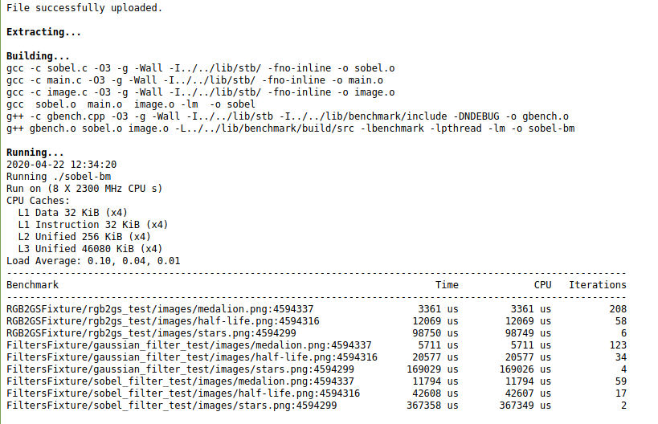

On peut voir des améliorations sur tous les temps du filtre sobel, comme l'on pouvait s'y attendre. J'ai pensé à une autre amélioration possible mais difficilement applicable à notre algorithme, soit le fait de ne pas effectuer de calculs si la case dans le kernel utilisé contient la valeur 0. Cette amélioration entraine une surcharge de l'algorithme dans notre cas. Cependant, si l'on souhaitait sacrifier la possibilité de modifier les kernels par la suite, une modification des boucles permettrait d'appliquer une légère amélioration.

Je me suis ensuite intéressé à la première fonction, rgb_to_grayscale. Pour rappel, lors de mon dernier rapport, j'avais expliqué que je ne voyais pas d'améliorations possibles étant donnée que les miss-caches étaient des miss-caches de dernier niveau, ce qui semblait indiquer qu'il s'agissait là du premier chargement des données. En revoyant la fonction, je me suis rendu compte que la hauteur et la largeur du résultat pouvaient comme dans les deux autres fonctions être stockées au lieu d'être récupérées à chaque accès. J'ai donc effectué cette  modification :
```
void rgb_to_grayscale(const struct img_t *img, struct img_t *result)
{
        size_t index = 0;
        size_t height = result->height;
        size_t width = result->width;
        int nb_components = img->components;
        for (size_t y = 0; y < height; y++) {
                for (size_t x = 0; x < width; x++) {
                        result->data[y * width + x] =
                                FACTOR_R * img->data[index + R_OFFSET] +
                                FACTOR_G * img->data[index + G_OFFSET] +
                                FACTOR_B * img->data[index + B_OFFSET];


                        index += nb_components;//img->components;
                }
        }
}
```
et le benchmark en résultant :
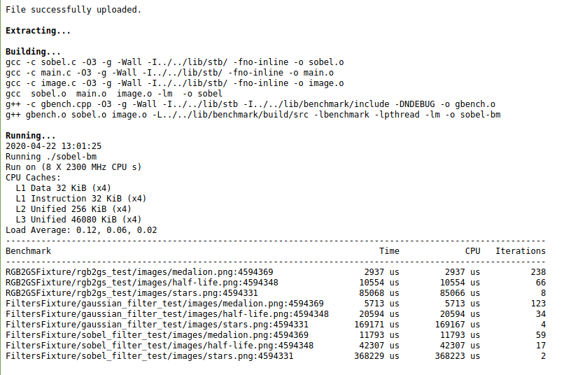

On peut voir une légère amélioration, comme c'était le cas dans les deux autres fonctions lors de cette modification. Je n'ai pas trouvé d'autres améliorations concernant cette fonction.

### Analyse des résultats et conclusion

Une fois ces améliorations effectués, il peut être intéressant de comparer les résultats avec les résultats du programme de base. Ainsi le tableau ci-dessous présente les améliorations entre la version de base et la version finale du programme :

|Test| Temps base[us] | temps final[us]  | Ratio d'amélioration[%] ((Temps base - temps final)/(Temp base/100))|
|--|--|--|--|
|rgb2gs/medalion| 3361| 2937| 12.62 |
|rgb2gs/h-f| 12069| 10554| 12.55 |
|rgb2gs/stars| 98920| 85068|14.00 |
|gaussian/medalion| 8950| 5713|36.17 |
|gaussian/h-f| 90577| 20594|77.26 |
|gaussian/stars| 1060797| 169171| 84.05|
|sobel/medalion| 15374| 11793|23.29 |
|sobel/h-f| 101840| 42307|58.46 |
|sobel/stars| 1359417| 368229|72.91 |

Avant de discuter ces résultats, je souhaite aussi comparer les résultats en terme de cache-miss entre les différentes fonctions. Pour cela, j'ai repris la commande utilisée dans le laboratoire 5 et j'ai comparé les résultats obtenus :
`valgrind --tool=callgrind --simulate-cache=yes ./sobel images/medalion.png images/edge_medalion.png`

##### gaussian_filter
- Programme de base

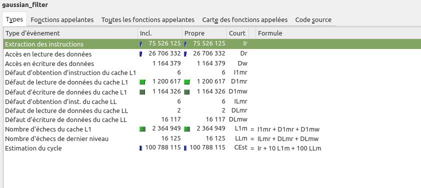
- Programme modifié

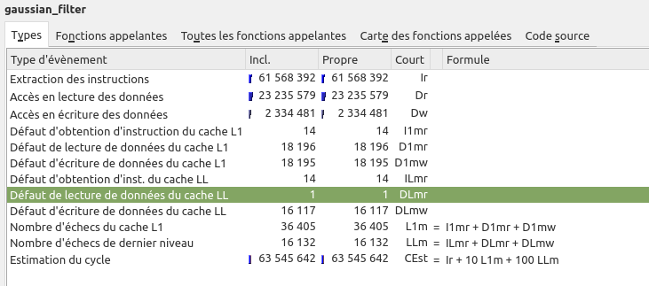
##### sobe_filter
- Programme de base

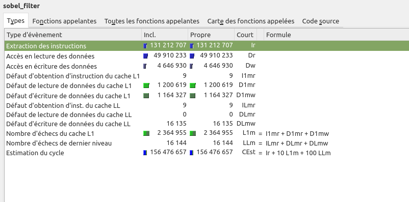
- Programme modifié

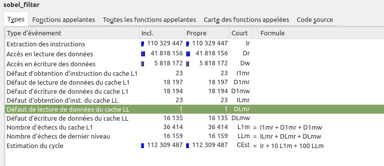
##### rgb_to_grayscale
- Programme de base

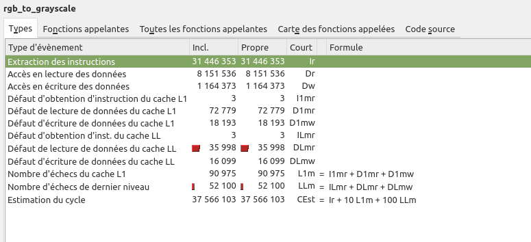
- Programme modifié

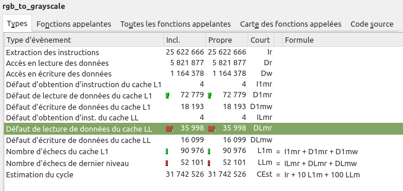

À l'aide des deux informations récupérées plus haut (temps et sortie kcachegrind), on peut conclure ce laboratoire avec les observations suivantes :
- Chaque fonction du programme qui devait être optimisée à pût d'une manière ou d'une autre être optimisé
- Le nombre de défaut d'échecs du cache L1 pour la fonction gaussian_filter et sobel_filter a drastiquement diminué, c'est ce que nous voulions et c'est ce qui entraine l'optimisation de ces fonctions.
- La diminution du nombre de défauts d'échecs du cache L1 a plus d'impact sur les fonctions devant traiter beaucoup d'informations (Voir ratio temps)
- L'optimisation de la fonction rgb_to_grayscale tient uniquement dans la réduction du nombre d'accès en écriture à height, components et width.


Voici qui conclut le laboratoire 6 d'HPC

###### Date : 22.04.2020
