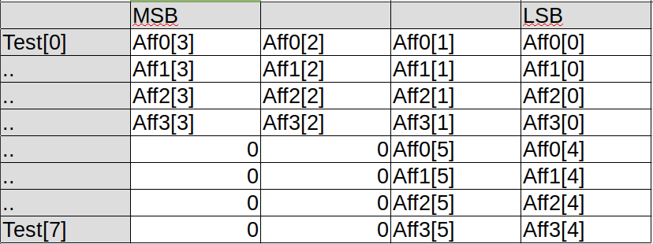
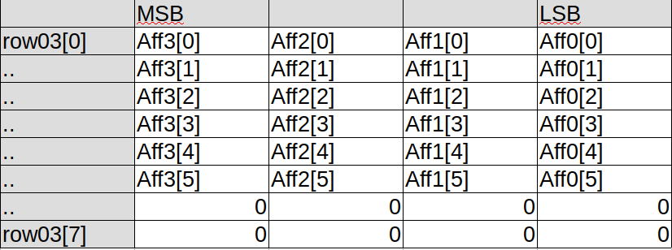
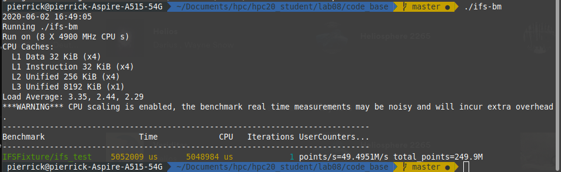
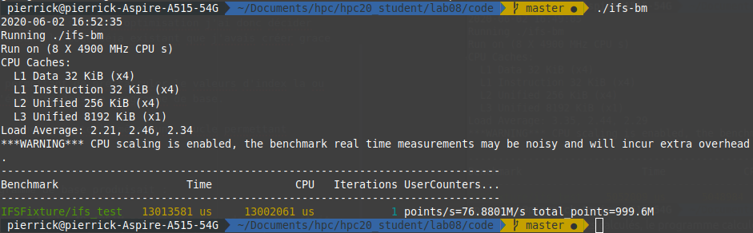

# Laboratoire 8 : Fractales IFS (SIMD)

### Pierrick Muller

## Première analyse
La première étape que j'ai effectuée consistait à analyser le code de base afin de sélectionner les parties de codes qui pouvaient être modifiées afin de permettre le traitement de 4 images en même temps.
En observant le code, j'ai pu définir trois parties distinctes pouvant être modifiées, soit :
- La génération des nombres aléatoires permettant le choix d'une des fonctions affines.
- la fonction affine_transform.
- Le contrôle et l'écriture en mémoire du résultat.

En y réfléchissant, je me suis rendu compte que l'écriture du résultat en mémoire posait problème, car la création des points aléatoires ne se faisait pas de manière exiguë. En observant l'algorithme, je me suis aussi rendu compte que le traitement des points afin de s'assurer qu'ils étaient présents dans les limites de l'image n'était pas nécessaire. Cependant, la partie d'écriture en mémoire appliquait des transformations aux points afin d'obtenir la bonne adresse. Cette transformation pouvait être effectuée grace aux instructions SIMD.

## Fonction affine_transform
J'ai commencé par m'intéresser à la fonction affine_transform. J'ai d'abord transformé le code à l'intérieur de la fonction en instructions SIMD :
```
xtemp = *x;
ytemp = *y;
*x = _mm_mul_ps(row03[0],xtemp);
temp = _mm_mul_ps(row03[1],ytemp);
*x = _mm_add_ps(*x,temp);
*x = _mm_add_ps(*x,row03[2]);

*y = _mm_mul_ps(row03[3],xtemp);
temp = _mm_mul_ps(row03[4],ytemp);
*y = _mm_add_ps(*y,temp);
*y = _mm_add_ps(*y,row03[5]);
```
Par rapport au code de base, le fonctionnement est le même. Simplement, x et y sont des pointeurs sur des variables de type `__m128` et row03 est un tableau de variable `_m128`. Ainsi, les 4 paires de points correspondant aux 4 images peuvent être calculées en même temps, les variables row03[0] à row03[5] correspondant aux différentes valeurs de la fonction affine choisie. La principale problématique vient du remplissage de row03. En effet, chaque variable `__m128` contenue dans row03 doit contenir l'élément de la fonction affine choisie pour cette itération de l'image à l'index correspondant. Afin de résoudre cette problématique, j'ai utilisé la macro `_MM_TRANSPOSE4_PS`, combinée avec une initialisation de certains tableaux de base.

Pour ce faire, j'ai dû effectuer certaines modifications afin de pouvoir utiliser correctement cette macro. La liste ci-dessous présente les différentes étapes qui ont été mise en place :
- Initialisation d'un tableau de variables `_m128` contenant les valeurs des différentes fonctions affines sous la forme :

Cette structure nous permettra par la suite d'efficacement utiliser la matrice `_MM_TRANSPOSE4_PS`. J'ajoute ici une note, je me suis rendu compte en rédigeant ce rapport que la partie de code gérant ce traitement avait un problème. En effet, dans le cadre de l'utilisation "Sierpinski triangle", la boucle permettant de peupler le tableau test fait une itération de trop, allant chercher des données au mauvais endroit. Ce problème n'impacte pas le programme, mais pourrait créer des problèmes en cas d'accès mémoires non autorisés. C'est une erreur, la solution aurait été de boucler en fonction du paramètre `nb_transforms` en assurant que le contenu du tableau non utilisé soit initialisé à 0.

- Modification de la variable rand_idx afin d'en faire un tableau de nombre random de 4, un pour chaque image. (Cette partie nécessitait la modification de la génération des chiffres aléatoires).

- Modification du prototype de la fonction affine_transform et de la fonction affine_transform en elle-même.

Ce dernier point s'est passé de la manière suivante. dans un premier temps, on boucle 4 fois afin de définir quelle fonction affine précédemment stockée doit être utilisée. On stocke la fonction correspondante dans un tableau de la même forme que le tableau présenté plus haut, mais en fonction de la valeur aléatoire définissant la fonction affine qui a été passée en paramètre. Ainsi, on se retrouve finalement avec un tableau ayant la même organisation que le tableau présenté plus haut, mais ou le contenu de la variable `i` et `i+4` correspond à la fonction affine voulue. Une fois cette opération effectuée, on peut utilise la macro `_MM_TRANSPOSE4_PS` deux fois (Une fois sur les lignes 0 à 3 et une fois pour les lignes 4 à 7) afin d'obtenir un tableau de variable `row03` utilisable dans la transformation de la fonction de base présentée plus haut. Ce nouveau tableau, si l'on part du principe que le tableau présenté plus haut était resté le même dans cette itération, soit que les valeurs aléatoires générées plus tot était 0,1,2 et 3, aurait cette disposition :


Voici qui clôture les explications sur la fonction affine_transform.

## xorshift32 (Génération aléatoire)
Comme dit plus haut, je souhaitais récupérer un tableau de nombres aléatoires entre 0 et "nb_transforms" me permettant dans la suite du programme de sélectionner la fonction affine à utiliser, et cela en se basant sur les opérations qui étaient effectuées dans le programme de base afin de générer un nombre aléatoire. J'ai décidé de modifier la fonction xorshift32 afin qu'elle s'occupe entièrement de gérer cette partie.

Dans un premier temps j'ai dû modifier la structure xorshift32_state afin qu'elle puisse stocker les états des 4 images. J'ai choisi de simplement utiliser une variable `__m128` stockant les différents états. Par la suite j'ai dû modifier le prototype de la fonction xorshift32. Cette dernière prend à présent en paramètre un tableau de float qui permet de stocker les 4 valeurs générées, notre structure xorshift32_state d'avant et le nombre de transformations. Les manipulations faites dans le programme de base sont ici effectuées à l'aide d'instruction SIMD. Je ne vais pas les recopier ici, mais simplement parler du workflow qui a été appliqué. On commence par récupérer l'état, puis à l'aide des instructions SIMD, on effectue les mêmes opérations que dans le programme de base (Des shifts et des xor). Une fois cela effectué, on stocke le nouvel état à la place de l'ancien, et on passe à la deuxième partie de cette fonction.

Cette deuxième partie consiste en un traitement différent en fonction du nombre de transformations. Dans le cadre d'un nombre de transformations de 4, calcule le modulo 4 directement à l'aide des instructions SIMD. En effet, il est facile d'effectuer un modulo 4, je me suis basé sur les " Bit Twiddling Hacks " qui nous avaient été présentés durant l'année. Par la suite, on convertit le résultat dans le tableau de float qui était fourni en paramètre et la fonction s'achève. Dans le cadre ou le modulo est un modulo 3, cela est plus problématique. La solution choisie est de convertir directement la variable `_m128i` en float, puis d'effectuer un modulo "nb_transforms" manuellement sur chaque valeur.

## Contrôle et écriture en mémoire du résultat.
Pour cette partie, je me suis rapidement rendu compte que l'écriture en mémoire des points générés n'allait pas pouvoir être optimisée. En effet, j'ai cherché une instruction qui pourrait permettre d'effectuer les opérations d'écritures en mémoire, mais sans succès.

Je me suis donc dans un premier temps intéressé à la condition de test permettant de s'assurer que le point était présent dans l'image. J'ai écrit une première bouture utilisant les instructions SIMD, mais dans le cadre de mes tests avec le programme de base, je me suis rendu compte de quelque chose d'étrange. En effet, j'avais ajouté une condition else devant afficher un message si le point était en dehors de l'image.

Cependant, cette information n'apparaissait jamais. Par souci d'optimisation j'ai donc décidé d'enlever cette partie de contrôle, tout en laissant le code déja existant que j'avais créé grace aux instructions SIMD en commentaire.

J'ai par contre ajouté des instructions SIMD permettant de pré-calculer les valeurs d'index là où elles étaient calculées directement lors de l'écriture dans le programme de base.

Pour ce qui est de l'écriture en mémoire , le principe reste le même, une boucle permettant l'écriture des points pour les 4 images.

## Benchmark et résultats.
Voici ce que le programme de benchmark du programme de base produisait :

Ainsi, avec 249.9M points calculés, le programme calcule 49.4951M points par seconde. Le but était d'améliorer ce résultat. Pour ce faire, il falait modifier le code afin qu'il retourne le nombre de points calculés de base fois 4. Une fois cette modification effectuée, voici le résultat du code optimisé :

On peut voir une amélioration d'environ 26M points par seconde en plus par rapport au programme de base. De plus, le nombre total de points est égal à 4 fois le nombre de points du programme de base, ce qui est normal et nécessaire.

L'objectif du laboratoire est donc atteint, étant donnée qu'on peut noter une amélioration entre le code de base et le nouveau code. De plus, comme les deux images ci-dessous le démontrent, l'image créée par le code amélioré fournit une image avec plus de points calculés :

- Version code de base :

- Version optimisée :


## Conclusion
Ce laboratoire m'a permis de découvrir les instructions SIMD. Cependant, j'ai l'impression d'avoir mal compris certaines choses, et d'être passé un peu à coté de mon laboratoire. Même si l'objectif final est atteint, je pense avoir mal géré le temps apporté à ce laboratoire, en me concentrant peut-être trop sur les mauvais points et en passant à coté de l'essentiel. J'espère que ce n'est un pressentiment, et je suis tout de même satisfait du travail que j'ai fourni au final. J'ai trouvé ce laboratoire très agréable malgré le point évoqué ci-dessus, et je pense m'intéresser a nouveau aux instructions SIMD à l'avenir.
